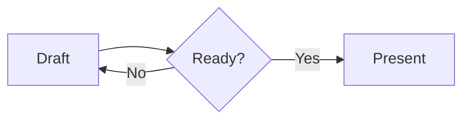

# Runtime Customization

Use this reference when wiring a SuperDeck Flutter app, assets, styles, templates, custom widgets, slide parts, or plugins.

## Minimal App Setup

SuperDeck apps must initialize before `runApp`:

```dart
import 'package:flutter/widgets.dart';
import 'package:superdeck/superdeck.dart';

Future<void> main() async {
  WidgetsFlutterBinding.ensureInitialized();
  await SuperDeckApp.initialize();

  runApp(SuperDeckApp(options: DeckOptions()));
}
```

The CLI expects `slides.md` at the project root. Build output lives in `.superdeck/`.

Typical setup:

```bash
dart pub global activate superdeck_cli
flutter create my_presentation
cd my_presentation
superdeck setup
flutter pub add superdeck
flutter pub add --dev superdeck_cli
dart run superdeck_cli:main build --watch
flutter run
```

`superdeck setup` creates `.superdeck/`, adds `.superdeck/` to `flutter.assets`, and patches macOS entitlements when a macOS runner exists.

## DeckOptions

`DeckOptions` holds base and named styles, custom widgets, slide parts,
templates, and the optional layout-debug flag. Styles and templates are Dart
code; there is no `styles.yaml`. The examples below show each concern where it
is used.

## Custom Widgets

A widget factory is `Widget Function(Map<String, Object?> args)`.

```dart
import 'package:flutter/widgets.dart';
import 'package:superdeck/superdeck.dart';

class MetricCard extends StatelessWidget {
  final String label;
  final String value;

  MetricCard(Map<String, Object?> args, {super.key})
    : label = args['label'] as String? ?? '',
      value = args['value'] as String? ?? '';

  @override
  Widget build(BuildContext context) {
    return Center(child: Text('$label: $value'));
  }
}

SuperDeckApp(
  options: DeckOptions(
    widgets: {
      'metricCard': MetricCard.new,
    },
  ),
);
```

For non-trivial widgets, validate arguments and parse them into a typed shape.
`Ack` is available from `package:superdeck_core/superdeck_core.dart`; see
`docs/guides/custom-widgets.mdx` for a schema example.

Widget blocks can read slide context:

```dart
final slide = SlideConfiguration.of(context);
final title = slide.options.title;
final index = slide.slideIndex;
final args = slide.options.args;
```

Use Flutter's `LayoutBuilder` for sizing. SuperDeck does not export a public widget-size measurement API.

If a widget factory is missing, SuperDeck renders `Widget not found: <name>`. If the factory throws, SuperDeck renders error details on the slide.

Built-ins `image`, `dartpad`, `webview`, and `qrcode` are registered first. User widgets with the same name override a built-in only when that name is used by the slide.

### Ack-Generated Args Wrappers

When an app already uses Ack codegen, a top-level `@AckInfer()` schema can
generate a typed args model. Keep both `.ack.dart` and `.ack.g.dart` part
directives, run `build_runner`, and parse the model in the widget constructor.
The factory still receives `Map<String, Object?>`; SuperDeck consumes `name`,
`align`, `flex`, `margin`, `padding`, and `scrollable` before calling it. Match
the app's pinned Ack versions. For a maintained schema example, see
`packages/playground/lib/features/ai/quick_agent/core/engine/schemas/deck_schemas.dart`.

## Slide Parts

Use slide parts for shared chrome:

- Header: `PreferredSizeWidget`
- Footer: `PreferredSizeWidget`
- Background: `Widget`

```dart
class DeckHeader extends StatelessWidget implements PreferredSizeWidget {
  const DeckHeader({super.key});

  @override
  Size get preferredSize => const Size.fromHeight(56);

  @override
  Widget build(BuildContext context) {
    final slide = SlideConfiguration.of(context);
    return Align(
      alignment: Alignment.centerLeft,
      child: Text(slide.options.title ?? ''),
    );
  }
}
```

Header and footer consume vertical space from the 1280x720 slide content area. Background fills the full slide.

Set `layout: fullscreen` in a slide's front matter to remove the resolved header and footer for that slide. This affects deck parts, named-template parts, and `defaultTemplate` parts, but preserves the resolved background and style.

## Styles and Templates

Slide frontmatter selects styles/templates:

```markdown
---
style: cover
template: brand
---
```

Resolution order:

- With a template: `defaultSlideStyle -> template.baseStyle -> template.styles[style]`.
- Without a template: `defaultSlideStyle -> options.baseStyle -> options.styles[style]`.
- `defaultTemplate` applies when a slide has no explicit `template`.
- `template: none` opts out of `defaultTemplate`.

Unknown templates or styles throw `ArgumentError` during configuration build, so verify names.

Template styles are isolated. A slide using `template: brand` and `style: cover` looks up `cover` in `SlideTemplate.styles`, not `DeckOptions.styles`.

### Typography, Block Frames, and Named Widgets

Use `SlideStyler` for typography, `BoxStyler` for the slide's outer frame, and
`BlockStyler` for block padding, margin, decoration, clipping, and variants.
Block size and content placement belong to Markdown `flex` and `align`, rather
than the block style. This `panels` style matches the composition example in
the authoring reference:

```dart
import 'package:flutter/material.dart';
import 'package:mix/mix.dart';
import 'package:superdeck/superdeck.dart';

final options = DeckOptions(
  baseStyle: SlideStyler(
    h1: TextStyler().style(TextStyleMix(fontSize: 64)),
    slideContainer: BoxStyler(
      padding: EdgeInsetsGeometryMix.symmetric(horizontal: 48, vertical: 28),
    ),
  ),
  styles: {
    'panels': SlideStyler(
      blockContainer: BlockStyler(
        padding: EdgeInsetsGeometryMix.all(24),
        decoration: BoxDecorationMix(
          color: const Color(0xFF202431),
          borderRadius: BorderRadiusMix.circular(20),
        ),
      ).variants([
        VariantStyle(
          const BlockVariant('image'),
          BlockStyler(padding: EdgeInsetsGeometryMix.all(0)),
        ),
      ]),
    ),
  },
);
```

`BlockVariant('image')` selects every `@image` widget block (and an explicit
`@widget` named `image`), including its widget subtree. It does not select
Markdown `@block` content or a single block instance. Names are exact and
case-sensitive. SuperDeck already removes padding and margin from `@webview`
by default; add a custom variant only when you want a different treatment.

Markdown block-level `margin` and `padding` override the matching resolved
style inset after variants. Omit the property to inherit the style, or set
`0` to remove that inset; the decoration and other style properties remain.
For a larger example, see `demo/lib/src/layout_showcase/showcase_style.dart`.

## Images and Assets

The CLI manages `.superdeck/` assets and ensures this entry exists unless `--skip-pubspec` is used:

```yaml
flutter:
  assets:
    - .superdeck/
```

Project-owned image files such as `assets/logo.png` still need to be available to Flutter:

- Native debug runtimes can load relative paths from the filesystem.
- Web/release/static rendering falls back to Flutter `AssetImage`, so declare project asset directories in `pubspec.yaml`.
- URLs use cached network loading.
- `file://` and absolute paths are supported for author-controlled `@image` sources, but they are not portable for deployed web decks.

Markdown images (``) use `UriValidator` and reject unsupported schemes such as `asset:`, `data:`, and path traversal (`..`) segments. `@image` parses author-controlled YAML more permissively and supports `data:` URIs through the image provider.

Bare image keys with no scheme and no path separators, such as `slide-intro.png`, can resolve through a bound `AssetCacheStore`; this is mainly used by generated/in-memory decks.

## Plugins

Use custom widgets for slide content that renders directly in Flutter. Use
plugins when the capability needs shell actions or build-time transforms.

Runtime plugin example: PDF export.

```dart
import 'package:superdeck_pdf/superdeck_pdf.dart';

SuperDeckApp(
  options: DeckOptions(),
  plugins: const [PdfPlugin()],
)
```

Mermaid diagrams render directly from fenced `mermaid` blocks, without a
plugin or build-time image. Supported families and syntax are documented in
`docs/guides/mermaid-diagrams.mdx`; a rejected diagram shows the failing line
on the slide:

````markdown

````

The diagram background is transparent, and its colors follow the app's light
or dark Flutter theme.

## Embedded WebViews

`@dartpad` and `@webview` share a deck-scoped controller cache. An optional
`cacheKey` allows sequential reuse across remounts; two live blocks never
share one controller. Static capture uses a placeholder. Native WebViews
restrict navigation to the source host or `allowedHosts`; Flutter web's iframe
cannot enforce that restriction. Run `superdeck setup` for macOS network
entitlements, and verify network access on the presentation target.

## Deployment Notes

SuperDeck deploys as a normal Flutter web app. For GitHub Pages, remember:

```bash
dart run superdeck_cli:main build
flutter build web --release --base-href "/<repo>/"
touch build/web/.nojekyll
```

The `.nojekyll` file prevents Pages from dropping Flutter's `_flutter/` directory.
