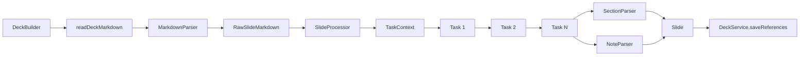
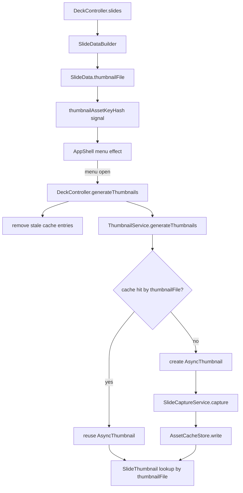

# Build, Config, and Thumbnail Workflow

This document explains the current SuperDeck flow after the breaking cleanup that removes `@column`, standardizes slide notes on `notes`, and makes thumbnail cache identity depend on `thumbnailFile`.

## High-level flow

```mermaid
flowchart TD
  A[slides.md] --> B[DeckBuilder.build]
  B --> C[DeckService.initialize]
  B --> D[MarkdownParser.parse]
  D --> E[RawSlideMarkdown[]]
  E --> F[SlideProcessor.processAll]
  F --> G[Task pipeline per slide]
  G --> H[TaskContext.slide.content]
  H --> I[SectionParser.parse]
  H --> J[NoteParser.parse]
  I --> K[Slide.sections]
  J --> L[Slide.notes]
  K --> M[Deck]
  L --> M
  M --> N[DeckService.saveReferences]
  N --> O[superdeck.json]
  N --> P[superdeck_full.json]
  N --> Q[generated_assets.json]
  N --> R[build_status.json]

  S[SuperDeckProvider] --> T[DeckConfig]
  T --> U{local or bundle}
  U -->|local| V[DeckService.loadDeckStream]
  U -->|bundle| W[BundledDeckService.loadDeckStream]
  V --> X[Deck]
  W --> X
  X --> Y[SuperDeckApp]
  Y --> Z[DeckController]
```

## Build pipeline details



- `DeckBuilder` owns the deck-level orchestration.
- `SlideProcessor` owns concurrency and per-slide task execution.
- Tasks mutate `TaskContext`; parsers run after tasks to build the final `Slide`.
- `SectionParser` handles layout blocks.
- `NoteParser` extracts HTML-comment-delimited speaker notes into `Slide.notes`.
- `DeckService.saveReferences()` writes the runtime artifacts the app consumes.

## Config and runtime ownership

```mermaid
flowchart TD
  A[DeckConfig] --> B{Config type}
  B -->|DeckConfig.local| C[DeckWorkspace + DeckService]
  B -->|DeckConfig.bundle| D[DeckWorkspace + BundledDeckService]
  C --> E[loadDeckStream]
  D --> E
  E --> F[SuperDeckProvider]
  F --> G[builder(context, deck)]
  G --> H[SuperDeckApp]
  H --> I[DeckController]
  I --> J[slides signal]
  I --> K[router]
  I --> L[thumbnail cache]
```

- `DeckConfig` only decides where the runtime deck comes from.
- `SuperDeckProvider` owns loading, error/loading states, and optional watch lifecycle.
- `SuperDeckApp` owns the `DeckController` lifecycle.
- `DeckController` owns render-time derived state from the loaded `Deck`.

## Thumbnail workflow



- `SlideDataBuilder` is the source of thumbnail identity.
- `thumbnailFile` changes when render-relevant inputs change, such as style/frame/debug/widget usage.
- `DeckController` exposes a lightweight hash of current thumbnail asset keys so the widget does not recompute identity itself.
- `AppShell` only decides when thumbnails should exist: when the menu is open.
- `ThumbnailService` owns `AsyncThumbnail` creation/reuse.
- `SlideThumbnail` reads by `thumbnailFile`, which matches the cache key.

## Why the thumbnail fix works

Before this change, thumbnails were cached by logical slide key. That meant a theme/style update could change the rendered slide while still reusing the old thumbnail entry.

Now the cache identity is:

1. derived in `SlideDataBuilder`
2. stored as `SlideData.thumbnailFile`
3. used as the cache key in `ThumbnailService`
4. cleaned up and observed in `DeckController`
5. consumed by `SlideThumbnail`

That makes the cache identity match the rendered thumbnail identity end to end.
