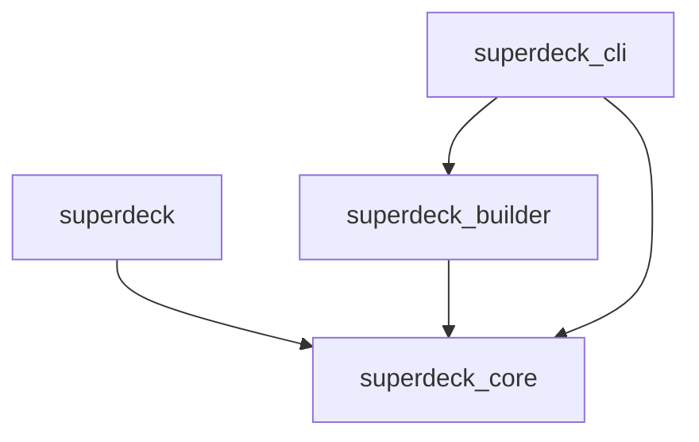
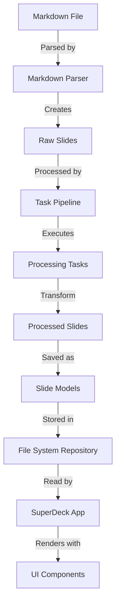

# SuperDeck Project Overview

## Introduction

SuperDeck is a Flutter-based presentation framework that enables creating visually appealing and interactive presentations using Markdown. This document provides a comprehensive overview of the project, based on our system discovery and analysis work.

## Project Architecture

SuperDeck follows a modular, multi-package architecture with clear separation of concerns:

### Key Packages

1. **superdeck**: Main Flutter application package
   - Contains the UI components and presentation rendering
   - Organized using atomic design principles
   - Depends on superdeck_core for domain models

2. **superdeck_core**: Core domain models and business logic
   - Platform-agnostic (no Flutter dependencies)
   - Contains data models like Slide, Block, and DeckConfiguration
   - Provides repository abstractions for data access

3. **superdeck_builder**: Content processing and transformation
   - Parses and processes markdown files
   - Implements task pipeline for slide processing
   - Converts specialized content (code blocks, mermaid diagrams)

4. **superdeck_cli**: Command-line interface
   - Provides commands for project setup and management
   - Integrates with the builder for processing presentations
   - Handles project configuration and template generation

## Key Architectural Patterns

Our analysis identified several architectural patterns used in SuperDeck:

1. **Repository Pattern**: Abstracts data access through `FileSystemPresentationRepository`
2. **Pipeline Pattern**: Sequential processing of tasks in `TaskPipeline`
3. **Atomic Design**: UI components organized into atoms, molecules, and organisms
4. **Provider Pattern**: State management through provider components
5. **Model-Mapper Pattern**: Type-safe serialization with dart_mappable
6. **Composite Pattern**: Hierarchical block structure for slide content
7. **Command Pattern**: CLI commands implemented as discrete command objects
8. **Factory Pattern**: Dynamic creation of blocks and widgets

See the [Architectural Patterns Catalog](.context/sessions/architectural-patterns.md) for detailed descriptions.

## Data Flow

The SuperDeck system processes presentation data through several transformation stages:

This pipeline transforms raw markdown content into structured presentation models that can be rendered by the Flutter application.

See the [Data Flow Analysis](.context/sessions/diagrams/data-flow.md) for a detailed breakdown.

## Core Components Analysis

As part of our detailed system analysis, we've created comprehensive documentation for the key components:

### Core Model Components

1. **[Slide Model](.context/sessions/component-analysis/slide-model.md)**: The fundamental data structure representing slides
   - Defines the core `Slide` class with properties for content and configuration
   - Includes `SlideOptions` for styling and metadata

2. **[Block Model](.context/sessions/component-analysis/block-model.md)**: The content building blocks for slides
   - Implements a polymorphic hierarchy of content block types
   - Uses sealed classes with discriminated serialization
   - Includes specialized blocks for text, images, code, and custom widgets

3. **[Deck Models](.context/sessions/component-analysis/deck-model.md)**: The top-level presentation models
   - Includes `DeckConfiguration` for file/directory management
   - Defines styling structures like `DeckOptions` and `DeckStyle`
   - Contains `SlideConfiguration` that combines raw slide data with styling

### Processing Components

4. **[Builder Components](.context/sessions/component-analysis/builder-components.md)**: The processing pipeline for transforming markdown
   - Implements a task-based architecture with `TaskPipeline`
   - Includes specialized parsers for markdown content
   - Contains tasks for format-specific processing (code formatting, diagram conversion)

### Rendering Components

5. **[Slide Renderer Components](.context/sessions/component-analysis/slide-renderer.md)**: The UI components for displaying presentations
   - Implements a hierarchical rendering system (slides > sections > blocks)
   - Uses Flutter widgets to display slide content
   - Handles layout calculations based on flex values

### Integrated Architecture

6. **[Integrated Architecture Analysis](.context/sessions/component-analysis/integrated-architecture.md)**: How all components work together
   - Details the complete flow from markdown content to rendered presentation
   - Explains integration points between different system components
   - Identifies architectural strengths and areas for improvement

## Project Strengths

Based on our analysis, SuperDeck demonstrates several key strengths:

1. **Clear Separation of Concerns**: Each package has well-defined responsibilities
2. **Modularity**: Packages can be developed and tested independently
3. **Extensibility**: Support for custom widgets, styles, and processing tasks
4. **Type Safety**: Strong typing and model validation throughout the codebase
5. **Modern Architecture**: Implementation of established design patterns
6. **Cross-Platform**: Flutter-based UI with platform-agnostic core logic
7. **Pipeline Orientation**: Clear data flow from input to output
8. **Immutable Data Models**: Functional approach with immutable structures

## Recommendations for Improvement

Our analysis also identified several areas for potential improvement:

1. **Documentation Enhancement**: More inline documentation of core components
2. **Interface Standardization**: More consistent interface patterns across packages
3. **Dependency Injection**: Consider a more formal DI framework for testing
4. **Error Handling**: More robust error handling and recovery mechanisms
5. **Performance Optimization**: Potential for caching improvements
6. **Component Hierarchy Simplification**: Reducing complexity in component trees
7. **Making Dependencies More Explicit**: Clearer indication of dependencies between components
8. **Further Decoupling**: Additional separation between rendering and data models

## Key Artifacts

Throughout our discovery process, we created several artifacts to document the system:

1. [System Architecture Overview](.context/sessions/2025-04-05-system-architecture-discovery.md) - Initial discovery document
2. [Architecture Diagrams](.context/sessions/diagrams/architecture-overview.md) - Visual representation of components and relationships
3. [Data Flow Analysis](.context/sessions/diagrams/data-flow.md) - Detailed breakdown of data transformation
4. [Architectural Patterns Catalog](.context/sessions/architectural-patterns.md) - Documentation of design patterns used
5. [Component Responsibilities and Prioritization](.context/sessions/component-responsibilities.md) - Analysis of component importance
6. [Component Analysis Documents](.context/sessions/component-analysis/) - Detailed analysis of key system components
7. [Integrated Architecture Analysis](.context/sessions/component-analysis/integrated-architecture.md) - Comprehensive system integration overview

## Conclusion

SuperDeck demonstrates a well-designed architecture with clear separation of concerns, modern design patterns, and a focus on extensibility. The modular package structure and clean interfaces provide a solid foundation for future development. 

The framework follows a pipeline approach where content flows from markdown through the builder system, into the data models, and finally to the renderer components. This architecture enables a smooth transformation from simple markdown files to sophisticated interactive presentations.

The documentation created during our discovery process provides comprehensive insights into the system's architecture and will serve as a valuable reference for ongoing development efforts. 