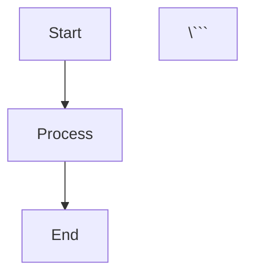

# Superdeck: Build Beautiful Presentations with Flutter & Markdown

**Superdeck** is a powerful Flutter framework for creating visually stunning, interactive presentations using Markdown. It combines the simplicity of Markdown with the flexibility of Flutter, enabling developers to build presentations that run seamlessly on web, mobile, and desktop platforms.

---

## What Superdeck Does

Superdeck transforms Markdown files into fully-rendered Flutter presentations with:

- **Two-stage build pipeline** - Parse Markdown at build-time, render Flutter widgets at runtime
- **Rich markdown extensions** - Block-based layouts, custom widgets, hero animations, and more
- **Flexible styling system** - Complete control over typography, colors, spacing, and themes
- **Asset management** - Build-time Mermaid rendering with content-hash caching and hooks for custom generators
- **Export & publishing** - PDF export and one-command deployment to GitHub Pages

---

## Core Features

### Markdown Layout System

Superdeck uses a powerful **@block syntax** for organizing slide content into flexible layouts:

```markdown
@section {
  flex: 2
}

@column {
  align: center
}

# Welcome to Superdeck
Build presentations with Markdown and Flutter

@column {
  align: center
  flex: 1
}


```

**Available Blocks:**
- **`@section`** - Multi-column container with configurable flex ratios
- **`@column`** - Display markdown content with alignment and scrolling
- **`@image`** - Images with fit options (cover, contain, fill, fitWidth, fitHeight)
- **`@dartpad`** - Embedded DartPad code snippets with live editing
- **`@widget`** - Custom registered Flutter widgets

**Alignment Options:** `topLeft`, `topCenter`, `topRight`, `centerLeft`, `center`, `centerRight`, `bottomLeft`, `bottomCenter`, `bottomRight`

### Custom Widget Support

Register custom Flutter widgets and use them directly in Markdown:

```dart
SuperDeckApp(
  options: DeckOptions(
    widgets: {
      'twitter': (args) => TwitterWidget(
        username: args.getString('username'),
        tweetId: args.getString('tweetId'),
      ),
      'chart': (args) => DataChart(
        data: args.getStringList('values'),
      ),
    },
  ),
)
```

Use in Markdown:

```markdown
@twitter {
  username: flutterdev
  tweetId: 1234567890
}
```

**Type-Safe Widget Arguments API:**
- `getString()`, `getInt()`, `getDouble()`, `getBool()` - Required typed values
- `getStringOrNull()`, `getIntOrNull()` - Nullable variants
- `getStringOr(key, defaultValue)` - Default fallbacks
- `getStringList()`, `getNested()` - Lists and nested objects

### Markdown Extensions

**Hero Animations** - CSS-like tags for seamless slide transitions:
```markdown
# My Title {.hero-title}
 {.hero-logo}
```

**GitHub Alerts** - Native alert blocks with icons:
```markdown
> [!NOTE]
> This is an informational note

> [!WARNING]
> Proceed with caution

> [!CAUTION]
> Critical warning
```

**Mermaid Diagrams** - Full support with automatic PNG rendering:
```markdown


**Code Highlighting** - Syntax highlighting for supported grammars (Dart/JSON/YAML/Markdown) with a Dart fallback
**Standard Markdown** - Full CommonMark + GitHub Flavored Markdown support

---

## Styling & Theming

### Comprehensive Styling API

Control every aspect of your presentation through the **SlideStyle** system:

```dart
final customStyle = SlideStyle(
  h1: TextStyler()
      .style(TextStyleMix(fontSize: 48, color: Colors.purple)),
  p: TextStyler()
      .style(TextStyleMix(fontSize: 18, height: 1.5)),
  code: MarkdownCodeblockStyle(
    textStyle: const TextStyle(fontFamily: 'Fira Code', color: Colors.white),
    container: BoxStyler()
        .color(const Color(0xFF1E1E1E))
        .padding(EdgeInsetsGeometryMix.all(24))
        .borderRadius(BorderRadiusMix.circular(16)),
  ),
  blockContainer: BoxStyler()
      .padding(EdgeInsetsGeometryMix.all(24))
      .borderRadius(BorderRadiusMix.circular(16)),
);
```

Import `package:flutter/material.dart` and `package:mix/mix.dart` to access the builders above, then reuse `customStyle` as a `DeckOptions.baseStyle` or as a named variant.

**Styleable Elements:**
- Typography: h1-h6, paragraphs, blockquotes
- Code: blocks, inline code, with syntax highlighting
- Markdown: tables, lists, checkboxes
- Alerts: note, tip, important, warning, caution
- Layout: containers, images, flex configurations

### Theme System

- **Mix 2.0 integration** - Type-safe, composable styles
- **Google Fonts support** - Custom typography with automatic loading
- **Named style variants** - Define multiple styles and apply per-slide
- **Material theme override** - Supply your own `ThemeData` (ships with a dark default)

Apply custom styles per-slide:
```markdown
---
title: My Slide
style: announcement
---
```

---

## Developer APIs

### Main Entry Point

```dart
SuperDeckApp(
  options: DeckOptions(
    baseStyle: customStyle,
    widgets: { /* custom widgets */ },
    styles: { /* named styles */ },
    parts: SlideParts(
      header: HeaderWidget(),
      footer: FooterWidget(),
      background: BackgroundWidget(),
    ),
    debug: false,
  ),
)
```

### Slide Parts (Reusable Components)

Define consistent elements across all slides:
- **Header** - Top-level widget (logos, titles)
- **Footer** - Bottom-level widget (slide numbers, social links)
- **Background** - Full-slide backgrounds (gradients, images)

### Navigation API

- **NavigationManager** - Keyboard and gesture input handling
- **Keyboard support** - Arrow keys and Space
- **Gesture support** - Tap zones, swipe gestures
- **Thumbnail panel** - Quick navigation overview

### CLI Tools

```bash
# Setup new project with proper configuration
superdeck setup

# Build presentation with file watching
superdeck build --watch

# Publish to GitHub Pages
superdeck publish
```

---

## Standout Features

### Two-Stage Build Pipeline
**Build-time:** Parse Markdown → Generate domain models → Output Dart code
**Runtime:** Load models → Apply syntaxes → Render Flutter widgets

This separation enables type safety, custom markdown extensions, and efficient bundling.

### Asset Pipeline
- Mermaid diagram rendering to PNG at build time via a headless browser
- Content-hash filenames prevent unnecessary regeneration
- Extensible generator pipeline (Mermaid included by default) for custom asset types
- Thumbnail generation for slide navigation

### Multi-Platform Support
Run presentations on:
- **Web** - Deploy as static site
- **Mobile** - iOS and Android apps
- **Desktop** - macOS, Windows, Linux

### Export & Publishing
- **PDF export** - Capture slides and generate PDFs
- **GitHub Pages** - One-command deployment
- **Thumbnails** - Auto-generated for navigation

---

## Getting Started

1. **Create a new Flutter project** with Superdeck dependencies
2. **Write your presentation** in Markdown using @block syntax
3. **Run the build command** to generate assets and domain models
4. **Launch the app** using `SuperDeckApp` widget
5. **Publish** to web or export to PDF

**Example Slide:**

```markdown
---
title: Welcome
style: hero
---

@section

@column {
  align: center
}

# Superdeck {.hero-title}

Build presentations with **Markdown** and **Flutter**

- Simple syntax
- Custom widgets
- Beautiful themes

@column

@dartpad {
  id: "d7b09149b0843f2b9d09e081e3cfd5a3"
  theme: dark
  run: true
}
```dart
void main() {
  runApp(MyPresentation());
}
\```
```

---

**Superdeck** empowers developers to create professional, interactive presentations with the tools they already know—Markdown and Flutter. Whether you're building a conference talk, product demo, or educational content, Superdeck provides the flexibility and power to bring your ideas to life.

**Learn more:** [superdeck on pub.dev](https://pub.dev/packages/superdeck)
