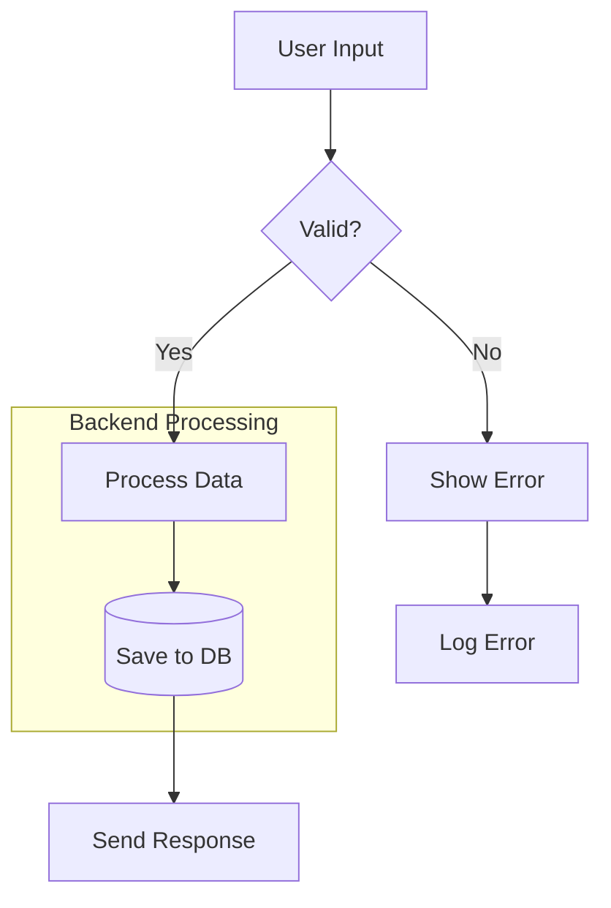
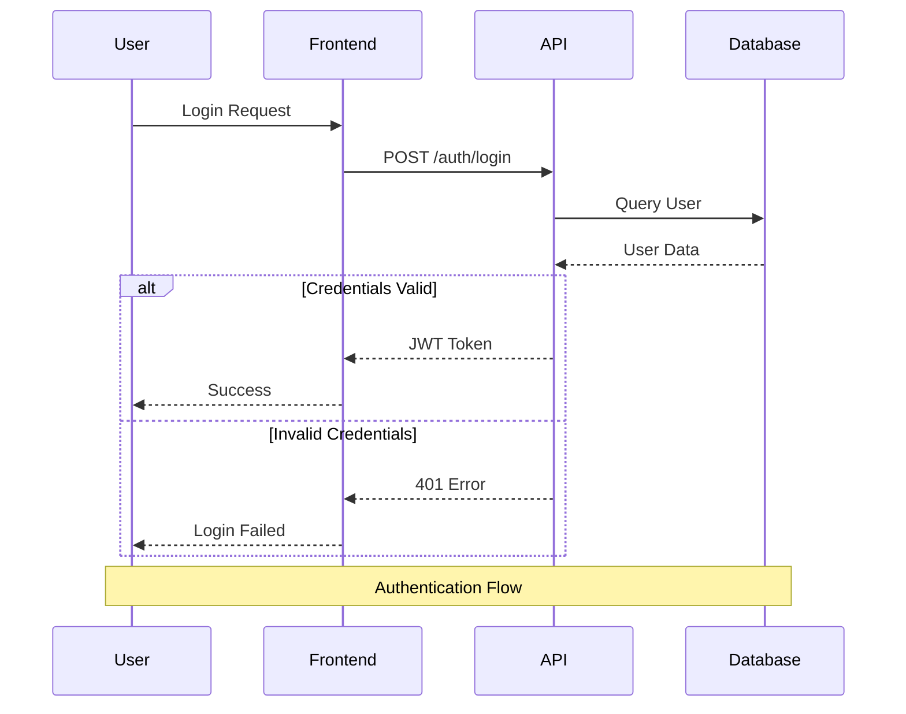
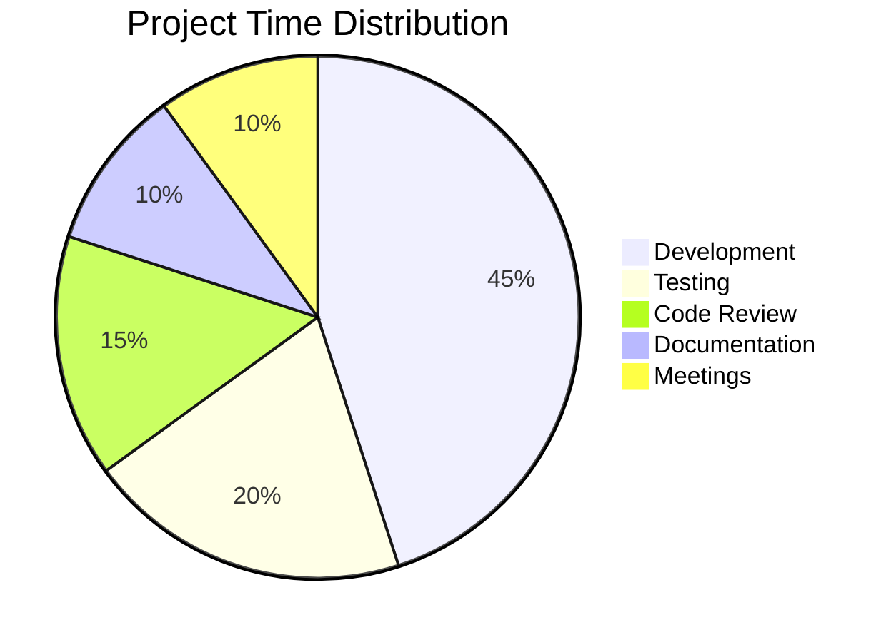
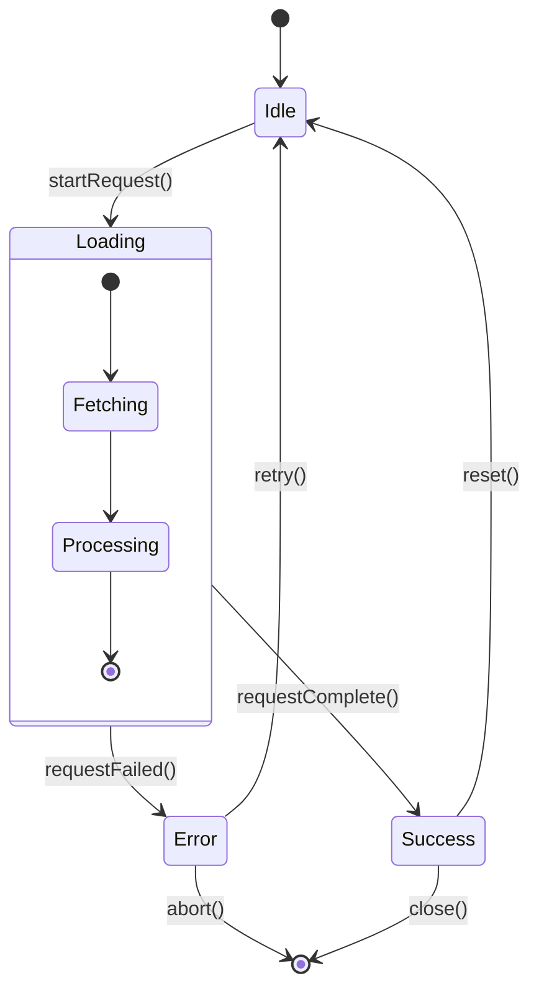
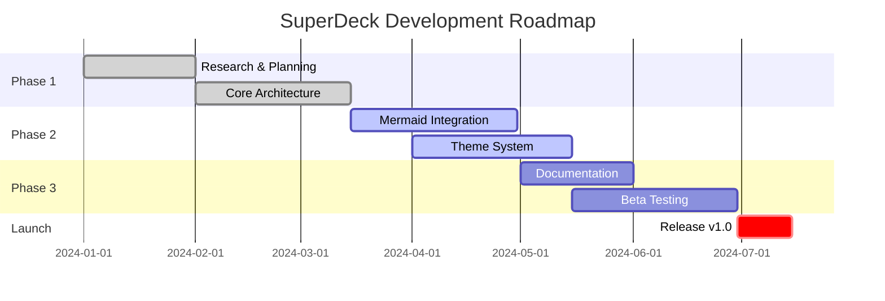
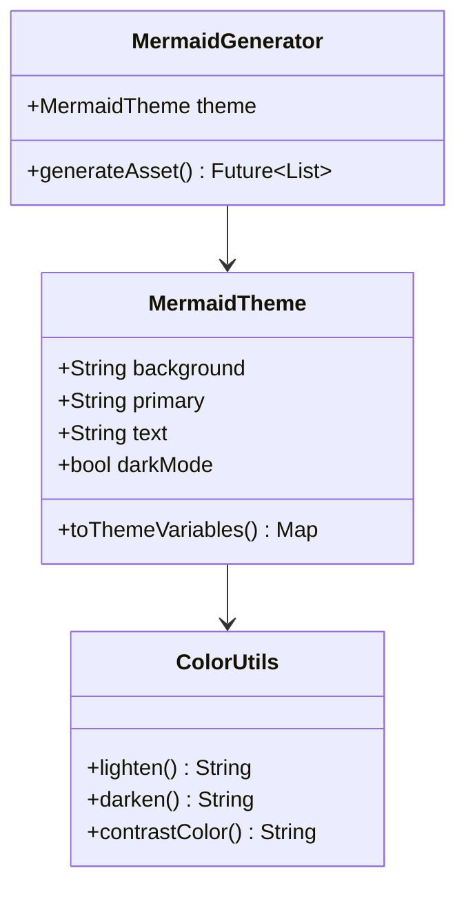

# Mermaid Visual Test

---

## Flowchart Test

```mermaid
flowchart TB
    A[User Input] --> B{Valid?}
    B -->|Yes| C[Process Data]
    B -->|No| D[Show Error]
    C --> E[(Save to DB)]
    E --> F[Send Response]
    D --> G[Log Error]

    subgraph "Backend Processing"
        C
        E
    end
```

---

## Sequence Diagram Test

```mermaid
sequenceDiagram
    participant User
    participant Frontend
    participant API
    participant Database

    User->>Frontend: Login Request
    Frontend->>API: POST /auth/login
    API->>Database: Query User
    Database-->>API: User Data

    alt Credentials Valid
        API-->>Frontend: JWT Token
        Frontend-->>User: Success
    else Invalid Credentials
        API-->>Frontend: 401 Error
        Frontend-->>User: Login Failed
    end

    Note over User,Database: Authentication Flow
```

---

## Pie Chart Test

```mermaid
pie title Project Time Distribution
    "Development" : 45
    "Testing" : 20
    "Code Review" : 15
    "Documentation" : 10
    "Meetings" : 10
```

---

## State Diagram Test

```mermaid
stateDiagram-v2
    [*] --> Idle
    Idle --> Loading : startRequest()
    Loading --> Success : requestComplete()
    Loading --> Error : requestFailed()

    Success --> Idle : reset()
    Error --> Idle : retry()

    Error --> [*] : abort()
    Success --> [*] : close()

    state Loading {
        [*] --> Fetching
        Fetching --> Processing
        Processing --> [*]
    }
```

---

## Gantt Chart Test

```mermaid
gantt
    title SuperDeck Development Roadmap
    dateFormat YYYY-MM-DD

    section Phase 1
    Research & Planning    :done, p1, 2024-01-01, 2024-02-01
    Core Architecture      :done, p2, 2024-02-01, 2024-03-15

    section Phase 2
    Mermaid Integration    :active, p3, 2024-03-15, 2024-04-30
    Theme System          :active, p4, 2024-04-01, 2024-05-15

    section Phase 3
    Documentation         :p5, 2024-05-01, 2024-06-01
    Beta Testing          :p6, 2024-05-15, 2024-06-30

    section Launch
    Release v1.0          :crit, p7, 2024-06-30, 2024-07-15
```

---

## Class Diagram Test

```mermaid
classDiagram
    class MermaidTheme {
        +String background
        +String primary
        +String text
        +bool darkMode
        +toThemeVariables() Map
    }

    class MermaidGenerator {
        +MermaidTheme theme
        +generateAsset() Future~List~
    }

    class ColorUtils {
        +lighten() String
        +darken() String
        +contrastColor() String
    }

    MermaidGenerator --> MermaidTheme
    MermaidTheme --> ColorUtils
```
