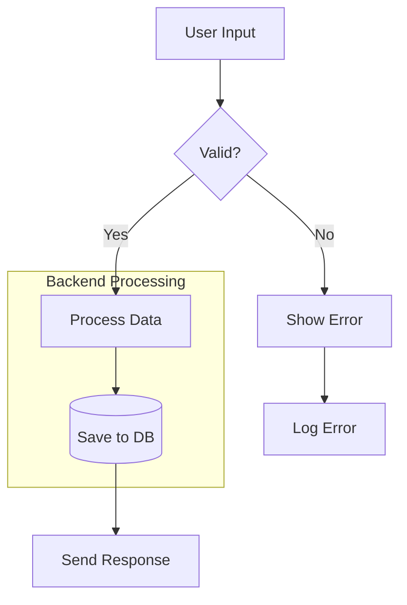
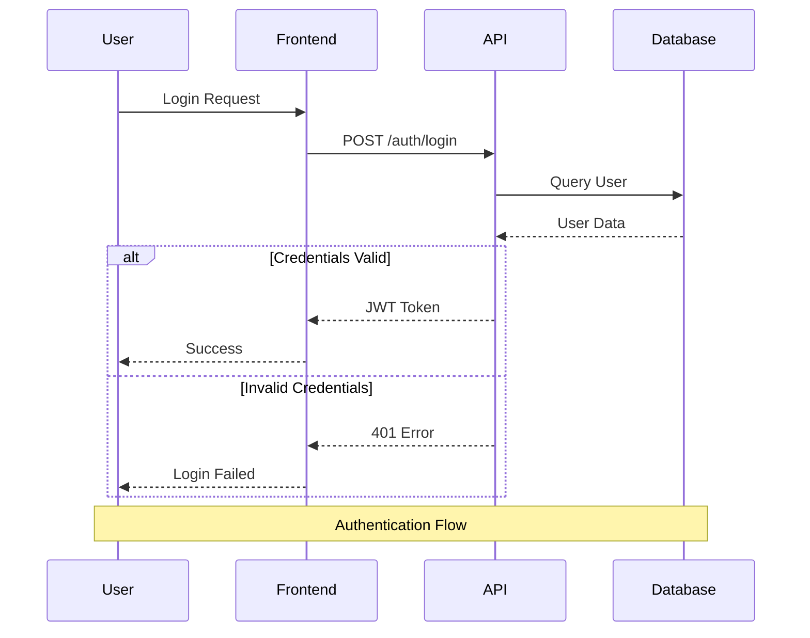
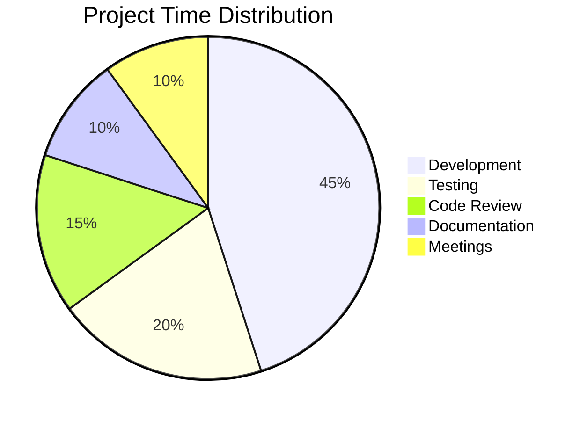
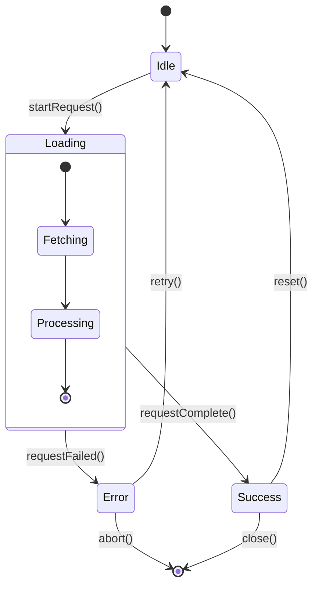
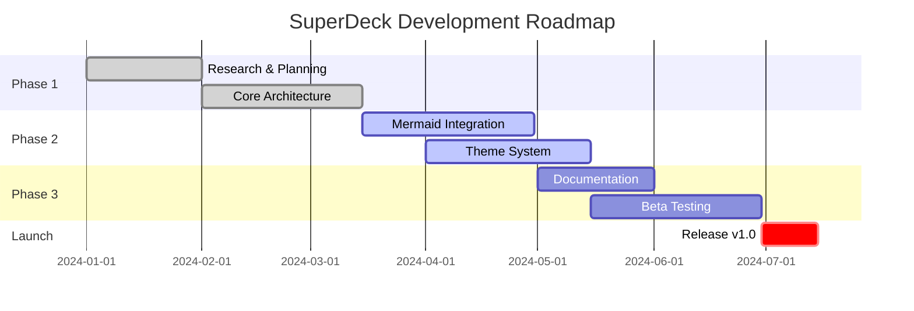
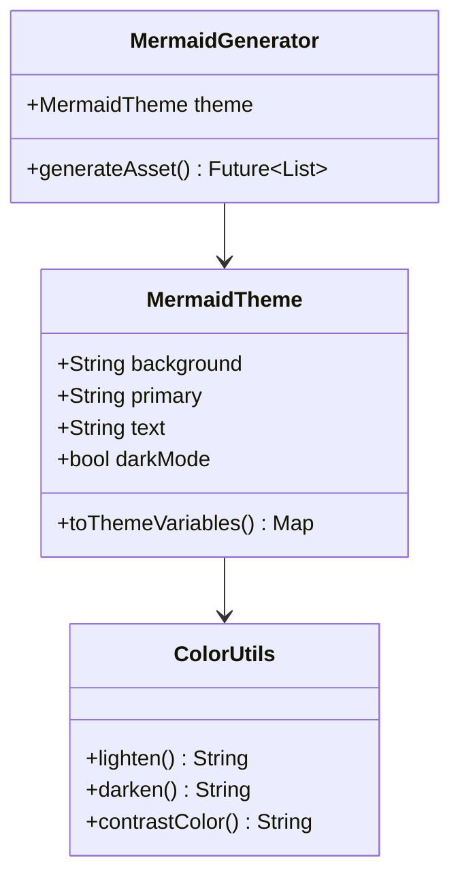

# Mermaid Theme Test Slides

Test slides showcasing the new simple 4-color theme system across the 5 most popular diagram types.

---

## 1. Flowchart (Most Popular)



**Features tested:**
- Node backgrounds and borders
- Text color and readability
- Arrow/line colors
- Subgraph styling
- Decision nodes (diamond shapes)

---

## 2. Sequence Diagram (Second Most Popular)



**Features tested:**
- Actor backgrounds and borders
- Signal/arrow colors
- Note styling
- Alt/else blocks
- Text readability on various backgrounds

---

## 3. Pie Chart (Third Most Popular)



**Features tested:**
- Automatic color generation for slices
- Text on colored backgrounds
- Title styling
- Mermaid's auto-derived pie1-12 colors

---

## 4. State Diagram (Fourth Most Popular)



**Features tested:**
- State node backgrounds
- Transition arrows
- Nested states (composite state)
- Start/end markers
- Transition labels

---

## 5. Gantt Chart (Fifth Most Popular)



**Features tested:**
- Task backgrounds (pending, active, done, critical)
- Grid colors
- Section headers
- Date axis styling
- Today line color (if applicable)

---

## Bonus: Class Diagram



**Features tested:**
- Class boxes
- Method and property styling
- Relationship arrows
- Generic type notation

---

## Theme System Features

This presentation demonstrates:

✅ **Simple 4-color API** - Only background, primary, text, darkMode needed
✅ **Automatic derivation** - Secondary, tertiary, and all diagram-specific colors
✅ **Consistent styling** - All diagram types use the same color palette
✅ **High readability** - Proper contrast between text and backgrounds
✅ **Mermaid integration** - Leverages Mermaid's built-in color derivation

---

## How to Test Different Themes

```dart
// Dark theme (default)
MermaidGenerator(theme: MermaidTheme.dark);

// Light theme
MermaidGenerator(theme: MermaidTheme.light);

// Custom theme
MermaidGenerator(
  theme: MermaidTheme(
    background: '#1a1a2e',
    primary: '#00ff88',
    text: '#ffffff',
    darkMode: true,
  ),
);
```

---

## What's Next?

- Run `dart ../packages/cli/bin/main.dart build` to generate all diagrams
- Check `.superdeck/assets/mermaid_*.png` for visual results
- Verify colors are consistent and readable
- Test with different themes by modifying the generator configuration

---

## End

Simple. Powerful. Consistent.

The new 4-color theme system for SuperDeck Mermaid diagrams.
