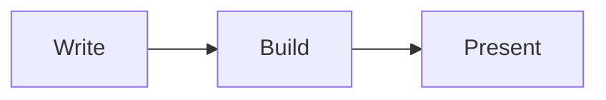

# SuperDeck {.heading}

Build beautiful presentations with Flutter & Markdown

---

@section

@column

### Markdown Support

- **Bold** and *italic* text
- Lists with bullets
- Inline `code` snippets
- [Links](#) and images
- Tables and more

@column

### Code Highlighting

```dart
Widget build(BuildContext context) {
  return Text('Hello SuperDeck!');
}
```

---

@section

@column

### Tables & Formatting

Markdown tables work seamlessly

@column

| Feature | Supported |
|---------|-----------|
| Markdown | ✅ |
| Code | ✅ |
| Diagrams | ✅ |
| Widgets | ✅ |

---

## Layout System {.heading}

---

### Three-Column Layout

@section

@column
**Column 1**
- Point one
- Point two

@column
**Column 2**
More content with **bold** text

@column
**Column 3**
```dart
final x = 42;
```

---

### Two-Column with Flex

@section

@column {
  flex: 2
}

**Left Side (flex: 2)**

Takes up 2/3 of the space

@column

**Right Side (flex: 1)**

Takes up 1/3

---

### Alignment Grid

@section

@column {
  align: top_left
}
Top Left

@column {
  align: top_center
}
Top Center

@column {
  align: top_right
}
Top Right

---

@section

@column {
  align: center_left
}
Center Left

@column {
  align: center
}
**Center**

@column {
  align: center_right
}
Center Right

---

@section

@column {
  align: bottom_left
}
Bottom Left

@column {
  align: bottom_center
}
Bottom Center

@column {
  align: bottom_right
}
Bottom Right

---

## Features {.heading}

---

@section

@column

### Code Highlighting

Multiple languages with syntax highlighting

@column

```dart
class Demo extends StatelessWidget {
  @override
  Widget build(BuildContext context) {
    return Text('Hello!');
  }
}
```

---

@section

@column

### Mermaid Diagrams

Generate diagrams automatically with theme support

@column



---

@section

@column

### Alert Blocks

GitHub-style alerts with icons and colors

@column

> [!NOTE]
> This is an informational note

> [!WARNING]
> Be careful with this!

---

@section

@column

### Hero Animations

Add CSS-like tags for smooth transitions between slides

```markdown
# Title {.hero-title}
```

@column

Next slides demonstrate this with the `.hero-title` tag animating smoothly

---

## Hero Demo {.heading}

---

# Hero Title {.hero-title}

## Hero Subtitle {.hero-subtitle}

These will animate smoothly

---

# Hero Title {.hero-title}

## Different Content {.hero-subtitle}

Same tags = smooth transitions!

---

@section

@column

### DartPad Support

Interactive code examples with live editing

@column

@dartpad {
  id: "d7b09149b0843f2b9d09e081e3cfd5a3"
}

---

@section

@column

### Image Blocks

Flexible display with fit options:
- contain
- cover
- fitWidth
- fitHeight

@column

@image {
  asset: "assets/structured_output.png"
  fit: "contain"
}

---

@section

@column

### Custom Widgets

Register Flutter widgets and use them directly in Markdown

@column

@mix-simple-box

---

## Advanced Features {.heading}

---

@section

@column

### Styling System

Complete control over appearance

@column

```dart
SlideStyle(
  h1: TextStyle(
    fontSize: 48,
    color: Colors.purple,
  ),
  codeBlock: CodeStyle(
    background: Colors.black,
  ),
)
```

---

@section

@column

### Build & Deploy

Simple commands for the full workflow

@column

```bash
# Build
superdeck build --watch

# Export PDF
superdeck export

# Deploy
superdeck publish
```

---

@column {
  align: center
}

# That's SuperDeck {.heading}

**Simple.** **Flexible.** **Powerful.**

Built with Flutter & Markdown
