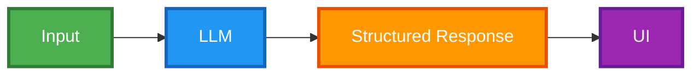

---

@section {
  flex: 2
}
@column {
  align: center
}
# Generative UI {.heading}
# with Flutter {.subheading}

---

@column {
  align: center
}

#### Leo Farias {.heading}
#### @leoafarias {.subheading}

@column {
  align: center_left
}
- Founder/CEO/CTO
- Open Source Contributor (fvm, mix, superdeck, others..)
- Flutter & Dart GDE
- Passionate about UI/UX/DX


---

@column

@column {
  align: center_left 
  flex: 2
}
> [!WARNING]  
> This presentation contains live AI-generated content. Unexpected things may occur during the demonstration.

@column

---

@column {
  flex: 2 
  align: center_right
}
### Generative UI {.heading}
@column
## VS 
@column {
  flex: 2
}
### AI Assisted Code Generation

<!-- Code Generation code as the output to boost developer productivity vs Generates widgets definitions to be rendered on the screen -->

---

### What is Generative UI? {.heading}

@column

- LLMs are great at generating content based on context
- GUIs are great at providing structured, interactive interfaces for user input and navigation


---

# LLM ❤️ GUI {.heading}

---

@column
@column {
  flex: 5
  align: center
}
### Creates dynamic, context-aware UIs by interpreting actions and maintaining state with LLMs for fluid, interactive responses. {.heading}

@column

---

### Benefits over Chat {.heading}

- More intuitive and user-friendly, especially for complex tasks
- Faster feedback loop between users and LLMs
- Enhances efficiency and interaction

---

@column

@column {
  flex: 3 
  align: center
}
### Flutter is Well-Suited for Generative UI {.heading}
Built for any screen: Ideal for generating adaptive UIs across devices and platforms.

@column

---

## Generative UI workflow

@section

@column {
  align: top_center
}


---

### How can LLMs Understand Your UI? {.heading}

@column


---

@column

### Define the Schema {.heading}

@column

```dart
final schema = Schema.array(
  description: 'List of recipes',
  items: Schema.object(
    properties: {
      'recipeName': Schema.string(
        description: 'Name of the recipe.',
        nullable: false,
      ),
    },
    requiredProperties: ['recipeName'],
  ),
);

```{.code}

---

@column {
  align: bottom_center
}

### Configure responseMimeType & responseSchema {.heading}

@column

```dart
final schema = Schema.array(
  description: 'List of recipes',
  items: Schema.object(
    properties: {
      'recipeName': Schema.string(
        description: 'Name of the recipe.',
        nullable: false,
      ),
    },
    requiredProperties: ['recipeName'],
  ),
);


final model = GenerativeModel(
  model: 'gemini-1.5-pro',
  apiKey: apiKey,
  generationConfig: GenerationConfig(
    responseMimeType: 'application/json',
    responseSchema: schema,
  ),
);

```{.code}

---

@section {
  flex: 2
}

@column {
  flex: 2
}

#### Passing a prompt to your model {.heading}

@column {
  flex: 3
}

```dart
final prompt = 'List a few popular cookie recipes.';
final response = await model.generateContent([Content.text(prompt)]);

print(response.candidates.first.content);

```{.code}

@section {
  flex: 3
}

@column {
  flex: 2
  align: bottom_left
}

#### JSON Response

@column {
  flex: 3
}

```json
[
  {
    "recipeName": "Chocolate Chip Cookies"
  },
  {
    "recipeName": "Peanut Butter Cookies"
  },
  {
    "recipeName": "Snickerdoodles"
  }
]
```


---

@column

### Color Palette Generator

Generate a color palette based on a given text.

- Name of the palette
- Font family
- Font color
- Color for each corner of the palette

--- 

@column{

}

## Color Palette Schema

@column{
  scrollable: true
  flex: 2
}

```dart
final schema = Schema.object(
  properties: {
  'name': Schema.string(
    description:'Name of the color palette',
    nullable: false,
  ),
  'font': Schema.enumString(
    enumValues: ColorPaletteFontFamily.enumString,
    description: 'Font to use for color palette name',
    nullable: false,
  ),
  'fontColor': Schema.string(
    description: 'Font color. Format: #FF0000',
    nullable: false,
  ),
  'topLeftColor': Schema.string(
    description: 'Top left color. Format: #FF0000',
    nullable: false,
  ),
  'topRightColor': Schema.string(
    description: 'Top right color. Format: #FF0000',
    nullable: false,
  ),
  'bottomLeftColor': Schema.string(
    description: 'Bottom left color. Format: #FF0000',
    nullable: false,
  ),
  'bottomRightColor': Schema.string(
    description: 'Bottom right color. Format: #FF0000',
    nullable: false,
  )
}, requiredProperties: [
  'name',
  'font',
  'fontColor',
  'topLeftColor',
  'topRightColor',
  'bottomLeftColor',
    'bottomRightColor',
  ],
);

```

---

## LLMs Orchestrate APIs

---

@section
@column
#### Gemini Function Calling
@column
The Function Calling feature is in Beta release

@section {
  flex: 4
}
{.cover}


--- 

@column {
  align: bottom_right
}

### User Interaction {.heading}
Natural Language way to interact with an LLM

@column {
  flex: 2
}


---


@column {
  align: center_left
}
### Widget Response {.heading}

@column {
  flex: 3
}


---

## What if the tool to use is a widget schema?

---


---

@column {
  flex: 2
}
### Dropdown Widget Schema

```dart
class DropdownSchemaDto {
  final String label;
  final String currentValue;
  final List<String> options;

  DropdownSchemaDto({
    required this.label,
    required this.currentValue,
    required this.options,
  });

```
@column {
  flex: 3
}

```dart
  static final schema = Schema.object(properties: {
    'label': Schema.string(
      description: 'The label of the dropdown',
      nullable: false,
    ),
    'currentValue': Schema.string(
      description: 'The currentValue of the dropdown',
      nullable: false,
    ),
    'options': Schema.array(
      description: 'The options of the dropdown',
      items: Schema.string(
        description: 'The options of the dropdown',
        nullable: false,
      ),
      nullable: false,
    )
  });
}
```

---

### Dropdown Schema Builder

@column {
  flex: 2
}
```dart
 ListTile(
  title: Text(schema.label),
  trailing: DropdownButton<String>(
    value: schema.currentValue,
    items: schema.options.map((option) {
      return DropdownMenuItem<String>(
        value: option,
        child: Text(option),
      );
    }).toList(),
    onChanged: (newValue) {},
  ),
);
```

---

### Widget Schemas


```dart
final schema = Schema.object(properties: {
  'textFields': Schema.array(
    description: 'A list of text fields',
    items: TextFieldSchemaDto.schema,
    nullable: true,
  ),
  'dropdowns': Schema.array(
    description: 'A list of dropdowns',
    items: DropdownSchemaDto.schema,
    nullable: true,
  ),
  'colorPickers': Schema.array(
    description: 'A list of colors pickers',
    items: ColorPickerDtoSchema.schema,
    nullable: true,
  ),
});

```

---
style: demo
---

@widgetSchema {
  kind: widget
  prompts:
    - Change top colors
    - Change font
    - Change all colors
    - Change everything
}

---
style: quote
---

> The future of UI might be orchestrating
> user experiences rather than creating it.

---

@section{
  align: bottom_center
  flex: 2
}
# Thank you

@section
Leo Farias
_@leoafarias
(GitHub, Twitter/X)

@column 

#### Slides + Code
https://github.com/leoafarias/gen-ui-talk
