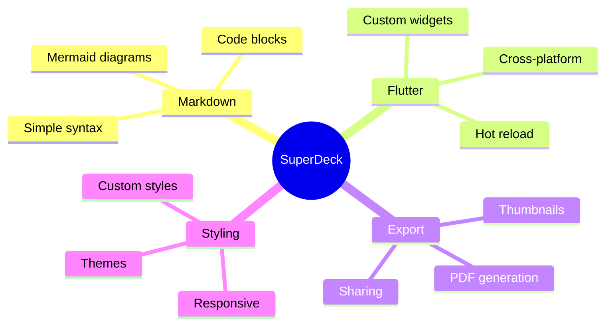
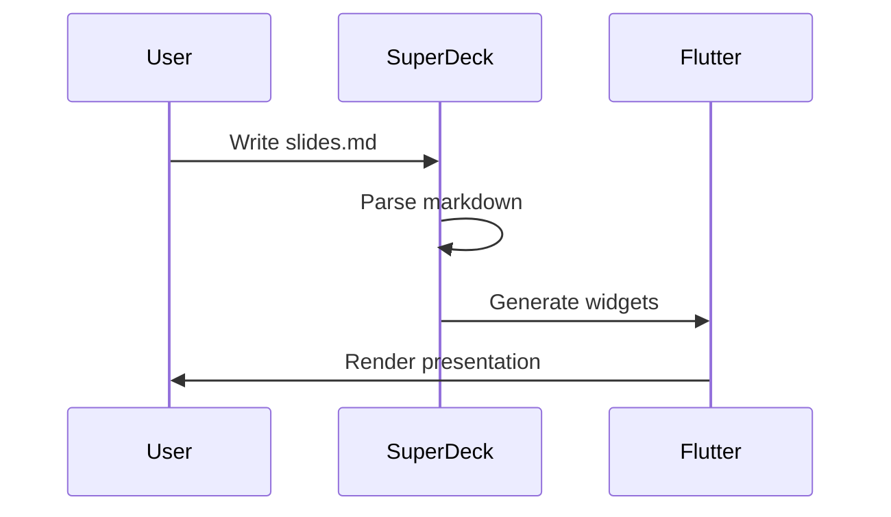
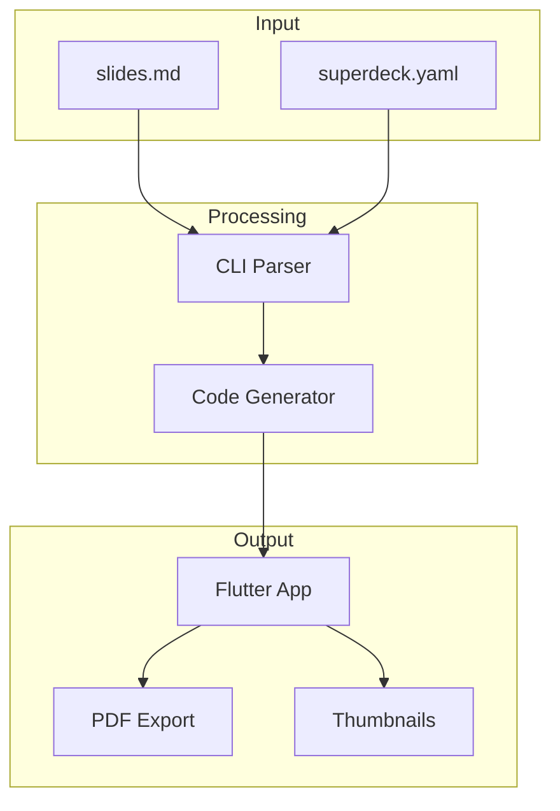

---

@section {
  flex: 2
}
@column {
  align: center
}
# SuperDeck {.heading}
# Build presentations with Flutter {.subheading}

---

@column {
  align: center
}

#### Leo Farias {.heading}
#### @leoafarias {.subheading}

@column {
  align: center_left
}
- Founder/CEO/CTO
- Open Source Contributor (fvm, mix, superdeck, others..)
- Flutter & Dart GDE
- Passionate about UI/UX/DX

---

## What is SuperDeck? {.heading}

@column

- Write slides in **Markdown**
- Render with **Flutter**
- Use **custom widgets** in your slides
- Export to **PDF**

---

@column
@column {
  flex: 5
  align: center
}
### A developer-first presentation framework that combines the simplicity of Markdown with the power of Flutter. {.heading}

@column

---

## Key Features {.heading}

@section

@column {
  align: top_center
}


---

### Markdown-First {.heading}

@column

Write your presentations in familiar Markdown syntax:

- Headers and text formatting
- Code blocks with syntax highlighting
- Lists and blockquotes
- Mermaid diagrams
- Custom widgets via `@widget` syntax

---

## Slide Layouts {.heading}

SuperDeck supports flexible layouts using sections and columns.

---

@column {
  flex: 2
  align: center_right
}
### Two Columns {.heading}

@column {
  flex: 3
}
```markdown
@column {
  flex: 2
}
Left content here

@column {
  flex: 3
}
Right content here
```

---

@section
@column {
  align: center
}
### Top Section

@section {
  flex: 2
}
@column {
  align: center
}
### Middle Section (flex: 2)

@section
@column {
  align: center
}
### Bottom Section

---

### Code Blocks {.heading}

@column {
  flex: 2
}

```dart
import 'package:superdeck/superdeck.dart';

void main() {
  runApp(
    SuperDeckApp(
      options: DeckOptions(
        widgets: {
          'my-widget': MyWidgetDefinition(),
        },
      ),
    ),
  );
}
```{.code}

---

### Mermaid Diagrams {.heading}

@column


---

### Sequence Diagrams {.heading}

@column



---

## Custom Widgets {.heading}

@column

Embed interactive Flutter widgets directly in your slides!

---

### Mix Box Example {.heading}

@column {
  flex: 2
}

```markdown
@mix-simple-box
```

@column {
  flex: 3
  align: center
}

@mix-simple-box

---

### Interactive Variants {.heading}

@column {
  flex: 2
}

Hover and press interactions using Mix variants.

@column {
  flex: 3
  align: center
}

@mix-variants

---

### Remix Buttons {.heading}

@column {
  flex: 2
}

Design system components with Remix.

@column {
  flex: 3
  align: center
}

@remix-button

---

### Animations {.heading}

@column {
  flex: 2
}

Implicit and keyframe animations with Mix.

@column {
  flex: 3
  align: center
}

@mix-animation

---

## Styling Options {.heading}

@column

SuperDeck supports custom themes and per-slide styling.

---

@column {
  scrollable: true
}

### Style Configuration

```yaml
# superdeck.yaml
styles:
  default:
    background: '#1a1a2e'
    primaryColor: '#4CAF50'

  code:
    background: '#0f0f23'

  quote:
    background: 'linear-gradient(...)'
```

---

### Per-Slide Styles

@column

```markdown
---
style: quote
---

> Your quote here
```

---
style: quote
---

> SuperDeck makes presentations feel like coding - simple, version-controlled, and powerful.

---

## Architecture {.heading}

@column



---

## Getting Started {.heading}

@column {
  flex: 2
}

1. Add SuperDeck to your project
2. Create `slides.md`
3. Run the CLI
4. Present!

@column {
  flex: 3
}

```bash
# Add dependency
flutter pub add superdeck

# Build slides
dart run superdeck_cli:main build

# Run presentation
flutter run
```

---

### Project Structure {.heading}

@column

```
my_presentation/
├── lib/
│   └── main.dart
├── slides.md
├── superdeck.yaml
└── pubspec.yaml
```

---

## Export Options {.heading}

@column

- **PDF Export** - Generate PDF for sharing
- **Thumbnails** - Auto-generated slide previews
- **Web Deploy** - Build for web hosting

---

@column
@column {
  flex: 3
  align: center
}
### Why SuperDeck? {.heading}

- Version control your presentations
- Use your favorite editor
- Leverage Flutter's ecosystem
- Hot reload while editing
- Cross-platform output

@column

---

@section{
  align: bottom_center
  flex: 2
}
# Thank You {.heading}

@section
Leo Farias
@leoafarias
(GitHub, Twitter/X)

@column

#### Source Code
https://github.com/leoafarias/superdeck
