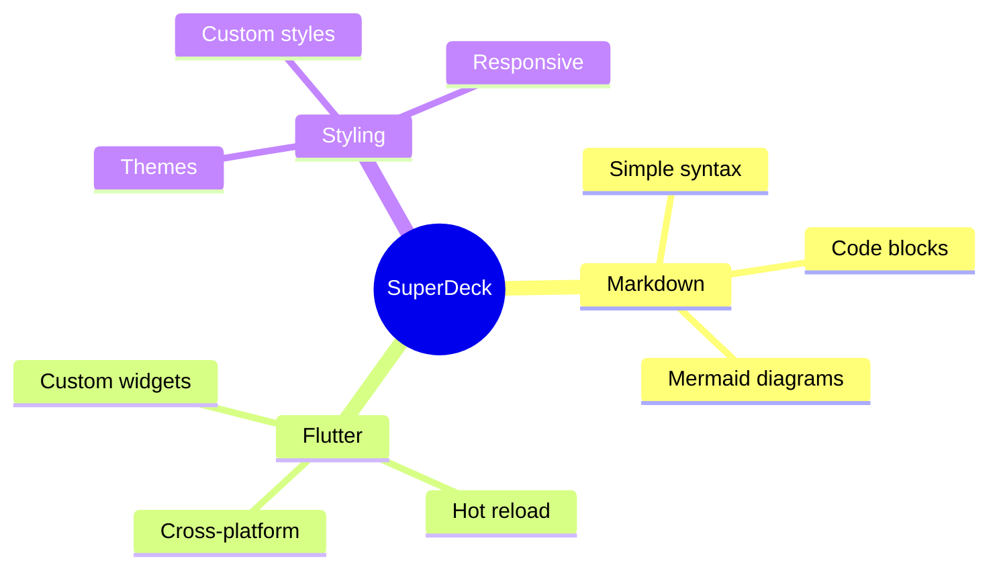
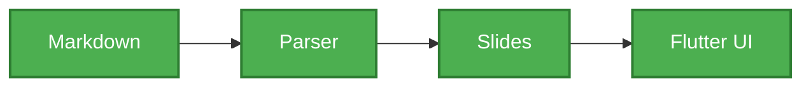
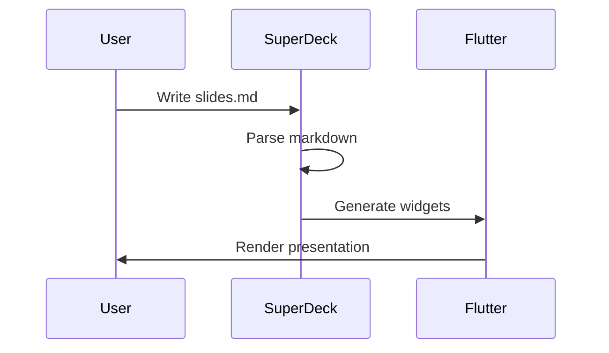
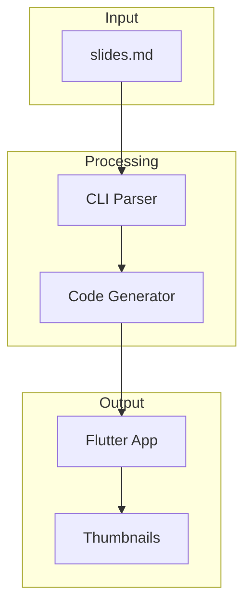

---

@section {
  flex: 2
}
@block {
  align: center
}
# SuperDeck {.heading}
# Build presentations with Flutter {.subheading}

---

@block {
  align: center
}

#### Leo Farias {.heading}
#### @leoafarias {.subheading}

@block {
  align: centerLeft
}
- Founder/CEO/CTO
- Open Source Contributor (fvm, mix, superdeck, others..)
- Flutter & Dart GDE
- Passionate about UI/UX/DX

---

## What is SuperDeck? {.heading}

@block

- Write slides in **Markdown**
- Render with **Flutter**
- Use **custom widgets** in your slides

---

@block
@block {
  flex: 5
  align: center
}
### A developer-first presentation framework that combines the simplicity of Markdown with the power of Flutter. {.heading}

@block

---

## Key Features {.heading}

@section

@block {
  align: topCenter
}

```mermaid
mindmap
  root((SuperDeck))
    Markdown
      Simple syntax
      Code blocks
      Mermaid diagrams
    Flutter
      Custom widgets
      Hot reload
      Cross-platform
    Styling
      Themes
      Custom styles
      Responsive
```

---

### Markdown-First {.heading}

@block

Write your presentations in familiar Markdown syntax:

- Headers and text formatting
- Code blocks with syntax highlighting
- Lists and blockquotes
- Mermaid diagrams
- Custom widgets via `@widget` syntax

---

## Slide Layouts {.heading}

SuperDeck supports flexible layouts using sections and columns.

---

@block {
  flex: 2
  align: centerRight
}
### Two Columns {.heading}

@block {
  flex: 3
}
```markdown
@block {
  flex: 2
}
Left content here

@block {
  flex: 3
}
Right content here
```

---

@section
@block {
  align: center
}
### Top Section

@section {
  flex: 2
}
@block {
  align: center
}
### Middle Section (flex: 2)

@section
@block {
  align: center
}
### Bottom Section

---

### Code Blocks {.heading}

@block {
  flex: 2
}

```dart
import 'package:superdeck/superdeck.dart';

void main() {
  runApp(
    SuperDeckApp(
      options: DeckOptions(
        widgets: {
          'my-widget': myWidgetFactory,
        },
      ),
    ),
  );
}
```{.code}

---

### Mermaid Diagrams {.heading}

@block


```mermaid
flowchart LR
    A[Markdown] --> B[Parser]
    B --> C[Slides]
    C --> D[Flutter UI]

    classDef default fill:#4CAF50,stroke:#2E7D32,stroke-width:2px,color:#fff
```

---

### Sequence Diagrams {.heading}

@block


```mermaid
sequenceDiagram
    participant User
    participant SuperDeck
    participant Flutter

    User->>SuperDeck: Write slides.md
    SuperDeck->>SuperDeck: Parse markdown
    SuperDeck->>Flutter: Generate widgets
    Flutter->>User: Render presentation
```

---

## Custom Widgets {.heading}

@block

Embed interactive Flutter widgets directly in your slides!

---

### Mix Box Example {.heading}

@block {
  flex: 2
}

```markdown
@mix-simple-box
```

@block {
  flex: 3
  align: center
}

@mix-simple-box

---

### Interactive Variants {.heading}

@block {
  flex: 2
}

Hover and press interactions using Mix variants.

@block {
  flex: 3
  align: center
}

@mix-variants

---

### Remix Buttons {.heading}

@block {
  flex: 2
}

Design system components with Remix.

@block {
  flex: 3
  align: center
}

@remix-button

---

### Animations {.heading}

@block {
  flex: 2
}

Implicit and keyframe animations with Mix.

@block {
  flex: 3
  align: center
}

@mix-animation

---

## Styling Options {.heading}

@block

SuperDeck supports custom themes and per-slide styling.

---

@block {
  scrollable: true
}

### Style Configuration

```dart
SuperDeckApp(
  options: DeckOptions(
    styles: {
      'default': borderedStyle(),
      'quote': quoteStyle(),
    },
  ),
)
```

---

### Per-Slide Styles

@block

```markdown
---
style: quote
---

> Your quote here
```

---
style: quote
---

> SuperDeck makes presentations feel like coding - simple, version-controlled, and powerful.

---

## Architecture {.heading}

@block


```mermaid
graph TB
    subgraph Input
        A[slides.md]
    end

    subgraph Processing
        C[CLI Parser]
        D[Code Generator]
    end

    subgraph Output
        E[Flutter App]
        G[Thumbnails]
    end

    A --> C
    C --> D
    D --> E
    E --> G
```

---

## Getting Started {.heading}

@block {
  flex: 2
}

1. Add SuperDeck to your project
2. Create `slides.md`
3. Run the CLI
4. Present!

@block {
  flex: 3
}

```bash
# Add dependency
flutter pub add superdeck

# Build slides
dart run superdeck_cli:main build

# Run presentation
flutter run
```

---

### Project Structure {.heading}

@block

```
my_presentation/
├── lib/
│   └── main.dart
├── slides.md
└── pubspec.yaml
```

---

@block
@block {
  flex: 3
  align: center
}
### Why SuperDeck? {.heading}

- Version control your presentations
- Use your favorite editor
- Leverage Flutter's ecosystem
- Hot reload while editing
- Cross-platform output

@block

---

## Slide Templates {.heading}

@block

Templates bundle **chrome** (header, footer, background) with an **isolated style system** — like Keynote master slides.

---
template: corporate
---

@block {
  align: center
}
# Corporate Template {.heading}

This slide uses the `corporate` template with branded header and footer.

---
template: corporate
style: highlight
---

@block {
  align: center
}
# Highlight Style {.heading}

Templates can have their own named style variants.

---
template: minimal
---

@block {
  align: center
}
# Minimal Template {.heading}

A clean, typography-focused template with no chrome distractions.

---

@section{
  align: bottomCenter
  flex: 2
}
# Thank You {.heading}

@section
Leo Farias
@leoafarias
(GitHub, Twitter/X)

@block

#### Source Code
https://github.com/leoafarias/superdeck
