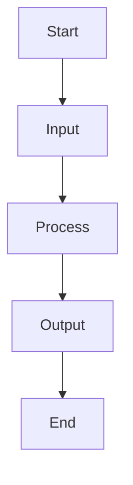

# Examples

Explore these real-world examples that demonstrate SuperDeck's capabilities. All examples are taken from actual SuperDeck presentations.

## Basic Layouts

### Centered Title Slide

```markdown
@section {
  flex: 2
}

@column {
  align: center
}

# Generative UI
# with Flutter

---
```

**Features shown:**
- Section with flexible sizing
- Centered content alignment
- Multi-line headings

### Two-Column Content

```markdown
@section

@column {
  flex: 2
  align: center_left
}

### Generative UI

@column

### VS

@column {
  flex: 2
}

### AI Assisted Code Generation

---
```

**Features shown:**
- Flexible column sizing with `flex`
- Mixed alignment options
- Comparative layouts

## Code Examples

### Syntax Highlighted Code Blocks

```markdown
@column

```dart
Column(
  crossAxisAlignment: CrossAxisAlignment.start,
  children: spans.map((span) {
    return RichText(
      text: TextSpan(
        style: interpolatedSpec.textStyle,
        children: [span],
      ),
    );
  }).toList(),
)
```

---
```

**Features shown:**
- Dart syntax highlighting
- Clean code formatting
- Single-column layout for code

### Complex Schema Definition

```markdown
@column

```dart
final schema = Schema.object(properties: {
  'name': Schema.string(
    description: 'The text content to display on color palette. Format: #FF0000',
    nullable: false,
  ),
  'font': Schema.enumString(
    enumValues: ColorPaletteFontFamily.enumString,
    description: 'The font to use for the poster text.',
    nullable: false,
  ),
  'fontColor': Schema.string(
    description: 'The hex color value of the poster text. Format: #FF0000',
    nullable: false,
  ),
  // ... more properties
});
```

---
```

## Visual Content

### Image with Cover Fit

```markdown
@column

 {.cover}

---
```

**Features shown:**
- External image URLs
- CSS class for image fitting
- Full-width image display

### Mixed Content Layout

```markdown
@section

@column



@column

 {.cover}

---
```

**Features shown:**
- Mermaid diagram integration
- Side-by-side content
- Mixed media types

## Interactive Content

### DartPad Integration

```markdown
@column

 {.cover}

@dartpad {
  id: "sample_dartpad_id"
  code: ""
}

@column

## Interactive Demo

---
```

**Features shown:**
- DartPad embedding
- Multi-block layouts
- Interactive code examples

### Custom Widget Integration

```markdown
@widget {
  name: "twitter"
  username: "flutter_dev"
  tweetId: "1746481414112256000"
  theme: "dark"
}
```

**Features shown:**
- Custom widget embedding with `@widget` block
- Named widget registration (`name: "twitter"`)
- Multiple arguments passed to widget
- External data integration

## Advanced Layouts

### Complex Multi-Section

```markdown
@section

@section {
  flex: 2
}

@column {
  align: center
  flex: 1
}

```dart
Column(
  crossAxisAlignment: CrossAxisAlignment.start,
  children: spans.map((span) {
    return RichText(
      text: TextSpan(
        style: interpolatedSpec.textStyle,
        children: [span],
      ),
    );
  }).toList(),
)
```

@column

 {.cover}

---
```

**Features shown:**
- Nested sections
- Complex flex layouts
- Multiple content types

### Profile/Bio Layout

```markdown
@section

@column {
  align: center_right
}

#### Leo Farias
@leoafarias

@column {
  align: center_left
}

- Founder/CEO/CTO
- Open Source Contributor
- Flutter & Dart GDE
- Passionate about UI/UX/DX

---
```

**Features shown:**
- Split personality layout
- Alignment-based design
- Professional bio formatting

## Special Features

### GitHub-Style Alerts

```markdown
@column {
  align: center_left
  flex: 2
}

> [!WARNING]  
> This presentation contains live AI-generated content. Unexpected things may occur during the demonstration.

---
```

**Features shown:**
- GitHub-style alert syntax
- Warning callouts
- Flexible column sizing

### Generative UI Demo

```markdown
@widget {
  name: "colorPalette"
  schema: true
  prompts: [tropical, vibrant, pastel, chocolatey pink unicorn, cyberpunk]
}
```

**Features shown:**
- Custom widget with complex arguments (`@widget` block)
- Array data passed as arguments
- AI-generated content integration
- Interactive demonstrations

### Interactive Counter Widget

```markdown
@section

@column
Try the interactive counter:

@column

@widget {
  name: "counter"
  start: 10
  step: 5
  label: "Demo Counter"
}
```

**Features shown:**
- Stateful custom widget
- Multiple argument types (int, string)
- Interactive user interface elements

## Mermaid Diagrams

### Process Flow

```markdown
@column


## Process Overview

Simple workflow representation using Mermaid syntax.

---
```

**Features shown:**
- Mermaid diagram integration
- Automatic diagram rendering
- Process visualization

## Styling Examples

### Custom CSS Classes

```markdown
# Important Heading {.heading}
## Subtitle Content {.subheading}

Regular content here.

Some special text {.here}

```dart
// Code with styling
function example() {
  return "formatted code";
}
``` {.code}
```

**Features shown:**
- CSS class application
- Custom styling hooks
- Consistent visual theming

## Complete Slide Examples

### Feature Announcement

```markdown
@column {
  flex: 3
  align: center
}

### Flutter is Well-Suited 
### for Generative UI

Built for any screen: Ideal for generating
adaptive UIs across devices and platforms.

@column

---
```

### Technical Explanation

```markdown
@section

@column

### Structured Output

@column

```dart 
final schema = Schema.array(
  description: 'List of recipes',
  items: Schema.object(
    properties: {
      'recipeName': Schema.string(
        description: 'Name of the recipe.',
        nullable: false,
      ),
    },
    requiredProperties: ['recipeName'],
  ),
);
```

---
```

## Best Practices Shown

1. **Flexible Layouts** - Use `flex` properties to control space distribution
2. **Mixed Content** - Combine text, images, code, and widgets effectively
3. **Alignment Control** - Use alignment for visual balance and hierarchy
4. **Code Integration** - Showcase code examples with proper syntax highlighting
5. **Interactive Elements** - Include DartPad and custom widgets for engagement
6. **Visual Hierarchy** - Use sections and columns to guide attention
7. **External Content** - Integrate images, social media, and external resources

## Common Patterns

- **Hero sections** with centered content and large text
- **Side-by-side comparisons** using two-column layouts
- **Code + explanation** layouts with code in one column, description in another
- **Process flows** using Mermaid diagrams
- **Interactive demos** with DartPad and custom widgets
- **Mixed media** combining images, text, and code

These examples demonstrate the flexibility and power of SuperDeck's block-based system for creating engaging, interactive presentations.