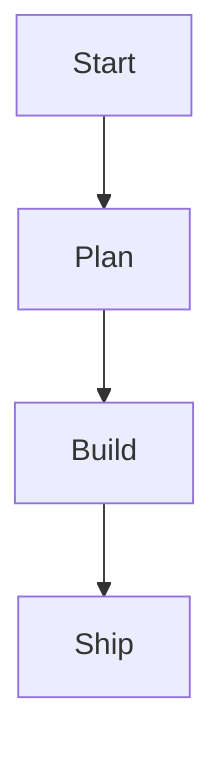

# Markdown Authoring Guide

Write your SuperDeck slides in Markdown. This guide shows you how to structure content and use block syntax.

---

## Quick Start

A basic slide with a title and content:

````markdown
---
title: My First Slide
---

@column

# Welcome to SuperDeck

- Write slides in Markdown
- Use blocks to control layout
- Style with Flutter themes
````

---

## Slide Options (Front Matter)

Each slide can have YAML front matter with these options:

- `title` – Slide title (appears in navigation and exports)
- `style` – Named style variant to apply (defined in `DeckOptions.styles`)
- Custom keys – Access via `slide.options.args['keyName']` in slide parts

````markdown
---
title: Product Vision
style: overview
---
````

---

## Block Types

SuperDeck has 3 core block types:

| Block | Purpose | Key Properties |
|-------|---------|----------------|
| `@section` | Container for horizontal layout | `flex`, `align`, `scrollable` |
| `@column` | Renders markdown content | `flex`, `align`, `scrollable` |
| `@widget` | Embeds custom widgets | `name` + custom args |

Built-in widgets (`image`, `dartpad`, `qrcode`, `mermaid`) use the same syntax.

---

## Layout Building Blocks

### `@section`

Groups blocks horizontally. Use sections to create multi-column layouts.

````markdown
@section {
  align: center
  flex: 2
}
````

### `@column`

Renders markdown content. Most slides use one or more columns.

````markdown
@column {
  flex: 2
  align: top_left
}

# Promise, Problem, Proof
- Lead with the outcome
- Contrast with the current state
- Finish with supporting data
````

### Common Properties

All blocks support these properties:

- `flex` – Relative size (default: `1`). A column with `flex: 2` takes twice the space of `flex: 1`
- `align` – Content alignment: `top_left`, `top_center`, `top_right`, `center_left`, `center`, `center_right`, `bottom_left`, `bottom_center`, `bottom_right`
- `scrollable` – Enable scrolling for overflow content (default: `false`)

---

## Built-in Widgets

### `@image`

Display images with fit options.

````markdown
@image {
  src: assets/value-loop.png
  fit: contain
  height: 420
}
````

Properties: `src` (required), `fit` (`contain`, `cover`, `fill`, `fitWidth`, `fitHeight`), `width`, `height`

### `@dartpad`

Embed interactive DartPad examples.

````markdown
@dartpad {
  id: "d7b09149b0843f2b9d09e081e3cfd5a3"
  theme: dark
  run: true
}
````

Properties: `id` (required), `theme` (`light` or `dark`), `embed`, `run`

> DartPad only works in release/profile mode. It shows a placeholder in debug mode.

### Custom Widgets

Register widgets in `DeckOptions.widgets`, then use them with the shorthand syntax:

````markdown
@metricCard {
  label: Activation
  value: "72%"
  trend: up
}
````

The widget name becomes the block type (`@metricCard`), and all properties are passed to your widget's `parse()` method.

---

## Markdown Features

### Standard Markdown

Use headings, lists, tables, and code blocks as you normally would:

````markdown
@column

# Slide Title

- First point
- Second point
- Third point

| Feature | Status |
|---------|--------|
| Auth    | Done   |
| API     | In Progress |
````

### Alerts

Use GitHub-style alerts for callouts:

````markdown
> [!NOTE]
> Additional context for readers.

> [!WARNING]
> Important information to highlight.

> [!TIP]
> Helpful suggestions.
````

### Hero Animations

Add class names to animate elements between slides:

````markdown
# Roadmap {.hero-title}
 {.hero-visual}
````

Elements with matching class names animate smoothly during slide transitions.

---

## Mermaid Diagrams

Add Mermaid diagrams using fenced code blocks:

````markdown

````

The CLI renders diagrams to images during build. Run `superdeck build` after editing diagrams.

---

## Styling

Apply named styles to individual slides using front matter:

````markdown
---
title: Key Takeaways
style: recap
---
````

Define styles in your app:

```dart
DeckOptions(
  styles: {
    'recap': SlideStyle(
      h1: TextStyler().style(TextStyleMix(fontSize: 64)),
    ),
  },
)
```

See the [SuperDeck Overview](./superdeck-overview) for more styling options.

---

## Next Steps

- Explore block properties in the [Block Types reference](../reference/block-types)
- Learn about publishing with the [CLI Reference](./cli-reference)
- Create custom widgets with the [Custom Widgets Guide](./custom-widgets)
