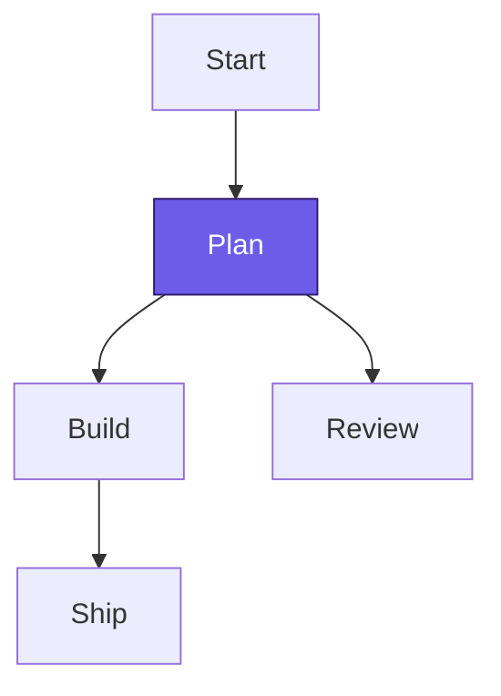

# Markdown Authoring Guide

SuperDeck translates Markdown blocks into typed schema objects that Flutter renders at runtime. Use this guide to structure slides, validate payloads, and keep narratives concise.

---

## Slide Metadata (Front Matter)

- Slides start with YAML front matter that maps directly to `SlideOptions`.
- Supported keys: `title`, `style`, plus custom arguments your deck reads at runtime.
- Speaker notes live in the generated JSON (`comments` array); they are not authored in front matter.

````markdown
---
title: Product Vision
style: overview
---
````

---

## Core Blocks and Schema Mapping

All block directives resolve to typed block objects:

| Markdown Block | Schema `type` | Key Payload Fields |
| -------------- | ------------- | ------------------ |
| `@section`     | `section`     | `flex`, `scrollable`, `align`, `blocks[]` |
| `@column`      | `column`      | `flex`, `scrollable`, `align`, `content` (Markdown AST) |
| `@image`       | `image`       | `asset`, `fit`, `width`, `height` |
| `@dartpad`     | `dartpad`     | `id`, `theme`, `embed`, `run` |
| `@widget`      | `widget`      | `name`, custom args captured by your widget factory |

> **Validation tip:** When generating or linting Markdown, assert that only the fields listed above are present so the builder passes validation.

---

## Layout Building Blocks

### `@section`

- Horizontal container that groups subsequent blocks; each directive becomes a `SectionBlock` with `flex`, `scrollable`, and optional `align`.
- Default `flex` is `1`. Increase the number to give a section more horizontal space relative to siblings.
- Keep one major section per slide unless you need asymmetrical bands.

````markdown
@section {
  align: center
  flex: 2
}
````

### `@column`

- Renders Markdown content inside a section and surfaces a parsed AST at `column.content`.
- Shared properties: `flex`, `align`, `scrollable` (defaults: `1`, `topLeft`, `false`).
- Use `flex` to weight columns (e.g., `flex: 3` for the primary narrative vs. `flex: 1` for supporting visuals).

````markdown
@column {
  flex: 2
  align: top_left
}

# Promise, Problem, Proof
- Lead with the outcome
- Contrast with the current state
- Finish with supporting data
````

### Alignment & Flex Reference

Valid `align` values are `topLeft`, `topCenter`, `topRight`, `centerLeft`, `center`, `centerRight`, `bottomLeft`, `bottomCenter`, and `bottomRight`. The Markdown parser accepts both camelCase and snake_case; project convention uses snake_case variants such as `top_left` and `center_right`. Reject anything outside those names when templating content. Keep `flex` values positive numbers; treat `0` as invalid.

---

## Media & Interactive Blocks

### `@image`

- Accepts `asset` (string path or URL), optional `fit`, `width`, `height`, plus the shared block properties.
- During the build, `asset` resolves to a hashed asset reference.
- Prefer high-resolution images sized for projection; use `fit: contain` for diagrams and `fit: cover` for hero imagery.

````markdown
@image {
  asset: assets/value-loop.png
  fit: contain
  height: 420
  align: center
}
````

### `@dartpad`

- Properties: `id` (required), `theme` (`light` or `dark`), `embed` (bool), `run` (bool). These map 1:1 to the DartPad block in the schema.
- Validate that IDs reference accessible DartPad snippets; missing IDs fail at runtime.

````markdown
@dartpad {
  id: "d7b09149b0843f2b9d09e081e3cfd5a3"
  theme: dark
  run: true
}
````

### `@widget`

- Resolves to a `widget` block with `name` populated from the directive (`@metricCard` → `name: "metricCard"`).
- Arguments remain strings until your registered widget parser reads them via `DeckOptions.widgets`.
- Use the type-safe getters (`getString`, `getInt`, `getBool`, etc.) to enforce required fields and throw descriptive errors.

````markdown
@metricCard {
  label: Activation
  value: "72%"
  trend: up
}
````

---

## Authoring Markdown Content

- Headings follow standard Markdown; the schema captures them as AST nodes with tags (`h1`–`h6`). Use a single `#` heading per slide to keep titles clear.
- Lists and tables render inside column blocks and are represented as list/table nodes in the AST. Limit bullet lists to three to five concise items.
- GitHub alert syntax (`> [!TIP]`, `> [!WARNING]`, etc.) is parsed as blockquotes with custom classes. Ensure the keyword matches the supported set so styling resolves.
- Apply hero transitions or custom styling classes with the `{.class-name}` syntax. Pair identical class names across slides to animate elements smoothly.

````markdown
> [!WARNING]
> Keep the API quota slide in the appendix until numbers are final.
````

````markdown
# Roadmap {.hero-title}
{.hero-visual}
````

---

## Mermaid Diagrams Inside Columns

- Author Mermaid code inside fenced blocks (` ```mermaid `). The build pipeline renders diagrams to PNG and rewrites the Markdown to an `img` element referencing the generated asset (e.g., `.superdeck/assets/mermaid_*.png`).
- Re-run `melos run build_runner:build` after editing diagrams to regenerate cached assets.
- Use `classDef` to control colors and line weights; match the deck theme for consistency.

````markdown

````

---

## Styling with `SlideStyle`

- Global typography, spacing, and block decorations come from `DeckOptions.baseStyle` and named variants in `DeckOptions.styles`.
- Adjust headings, paragraphs, code blocks, and tables via `TextStyler`, `MarkdownCodeblockStyle`, and `BoxStyler` to keep slides legible on large displays.
- Apply custom variants per slide through front matter (`style: recap`) so presenters can swap themes without touching layout blocks.

---

## Validation Workflow

1. **Lint payloads** – Check each block for allowed keys and enumerated values (alignment, fit, booleans) before committing.
2. **Run builders** – `melos run build_runner:build` refreshes Mermaid assets and generated JSON.
3. **Analyze** – `melos run analyze` and `melos run custom_lint_analyze` catch schema mismatches and missing assets early.
4. **Visual review** – Open the deck with the FVM-pinned Flutter SDK to confirm flex sizing, alignment, and typography.

Use this guide alongside the [SuperDeck Overview](./superdeck-overview) and the [Block Types reference](../reference/block-types) to keep Markdown accurate, validated, and presentation-ready.
