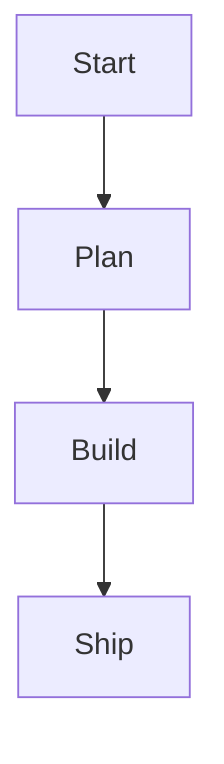

# Markdown authoring guide

Write your SuperDeck slides in Markdown. This guide shows you how to structure content and use block syntax.

---

## Quick start

A basic slide with a title and content:

````markdown
---
title: My First Slide
---

@block

# Welcome to SuperDeck

- Write slides in Markdown
- Use blocks to control layout
- Style with Flutter themes
````

---

## Slide options (front matter)

Each slide can have YAML front matter with these options:

- `title` – Slide title (appears in navigation and exports)
- `style` – Named style variant to apply (defined in `DeckTheme.styles`)
- `template` – Optional slide template name. Use `none` to opt out of a configured default template
- Custom keys – Access via `slide.options.args['keyName']` in slide parts

````markdown
---
title: Product Vision
style: overview
---
````

---

## Block types

Use these block types when you compose slides:

- `@section` for horizontal layout containers.
- `@block` for markdown content.
- `@widget` for custom Flutter widgets.

For the full syntax and argument reference, see the [Markdown syntax reference](../reference/markdown-syntax).

---

## Layout building blocks

### `@section`

Groups blocks horizontally. Use sections to create multi-column layouts.

````markdown
@section {
  align: center
  flex: 2
}
````

### `@block`

Renders markdown content. Most slides use one or more markdown blocks.

````markdown
@block {
  flex: 2
  align: topLeft
}

# Promise, Problem, Proof
- Lead with the outcome
- Contrast with the current state
- Finish with supporting data
````

### Common properties

Use these properties on blocks:

- `flex` – Relative size (default: `1`). A block with `flex: 2` takes twice the space of `flex: 1`
- `align` – Content alignment such as `topLeft`, `center`, and `bottomRight`
- `scrollable` – Enable scrolling for overflow content (default: `false`)

For complete value definitions, see the [Markdown syntax reference](../reference/markdown-syntax).

---

## Speaker notes and escapes

### Speaker notes

Use HTML comments for speaker notes:

````markdown
<!-- Remind audience that this chart excludes enterprise customers -->
````

### Escaped directives

Prefix a directive with `_@` to render it literally instead of starting a block:

````markdown
_@section
_@block { flex: 2 }
````

---

## Built-in widgets

### `@image`

Display images with fit options.

````markdown
@image {
  src: assets/value-loop.png
  fit: contain
  height: 420
}
````

For all `@image` arguments, see the [Markdown syntax reference](../reference/markdown-syntax).

### `@dartpad`

Embed interactive DartPad examples.

````markdown
@dartpad {
  id: "d7b09149b0843f2b9d09e081e3cfd5a3"
  theme: dark
  run: true
}
````

For all `@dartpad` arguments, see the [Markdown syntax reference](../reference/markdown-syntax).

> DartPad uses an embedded WebView. Make sure your target platform supports WebViews.

### Custom widgets

Register widgets in `DeckTheme.widgets`, then use them with the shorthand syntax:

````markdown
@metricCard {
  label: Activation
  value: "72%"
  trend: up
}
````

The widget name becomes the block type (`@metricCard`), and all properties are passed to your widget's `parse()` method.

---

## Markdown features

### Standard Markdown

Use headings, lists, tables, and code blocks as you normally would:

````markdown
@block

# Slide Title

- First point
- Second point
- Third point

| Feature | Status |
|---------|--------|
| Auth    | Done   |
| API     | In Progress |
````

In the standard local runtime build flow, fenced `dart` blocks are reformatted before they are rendered on a slide. If you pass fenced-code options, prefer the braced header form; the current parser also accepts a legacy compatibility form without braces after the language token.

### Alerts

Use GitHub-style alerts for callouts:

````markdown
> [!NOTE]
> Additional context for readers.

> [!WARNING]
> Important information to highlight.

> [!TIP]
> Helpful suggestions.
````

### Hero animations

Add class names to animate elements between slides:

````markdown
# Roadmap {.hero-title}
 {.hero-visual}
````

Elements with matching class names animate smoothly during slide transitions.

---

## Mermaid diagrams

Add Mermaid diagrams using fenced code blocks:

````markdown

```mermaid
graph TD
  Start --> Plan --> Build --> Ship
```
````

SuperDeck renders diagrams to images during the local runtime build and publish flows. During development, `DeckSource.local(watch: true)` rebuilds them when `slides.md` changes.

---

## Styling

Apply named styles to individual slides using front matter:

````markdown
---
title: Key Takeaways
style: recap
---
````

Define styles in your app:

```dart
DeckTheme(
  styles: {
    'recap': SlideStyle(
      h1: TextStyler().style(TextStyleMix(fontSize: 64)),
    ),
  },
)
```

See the [SuperDeck Overview](./superdeck-overview) for more styling options.

---

## Next steps

- Explore syntax details in the [Markdown syntax reference](../reference/markdown-syntax)
- Explore block behavior in the [Block types reference](../reference/block-types)
- Learn about publishing with the [CLI Reference](./cli-reference)
- Create custom widgets with the [Custom Widgets Guide](./custom-widgets)
