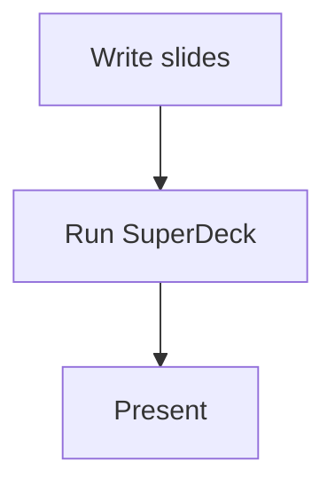
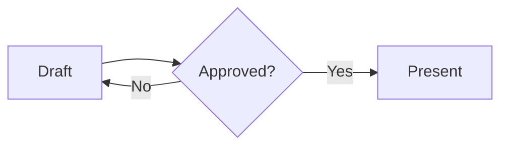
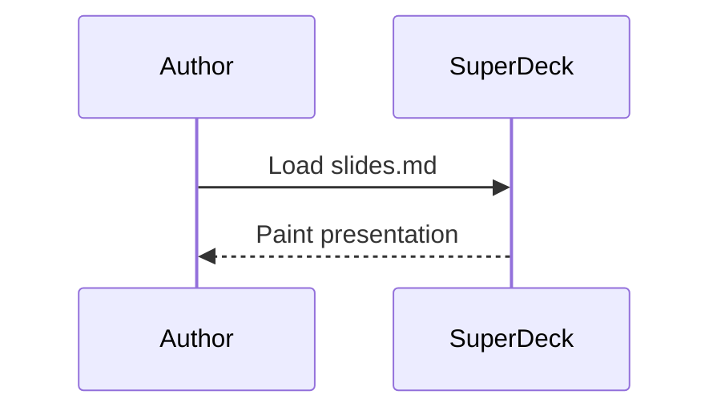
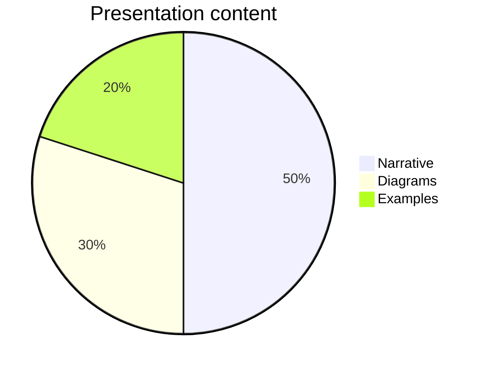
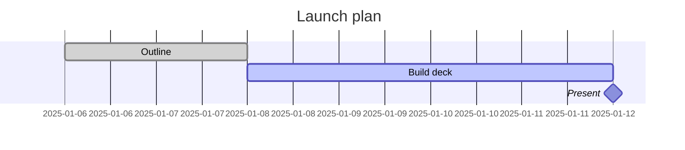
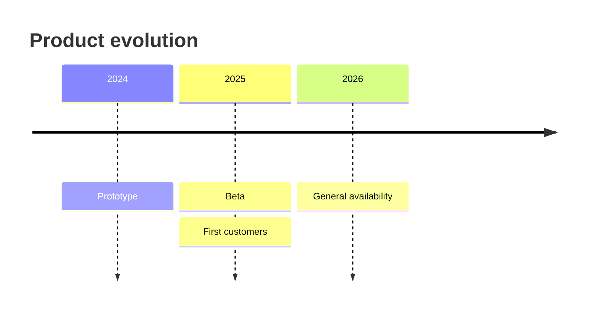
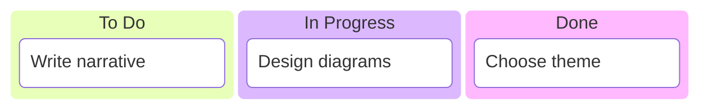
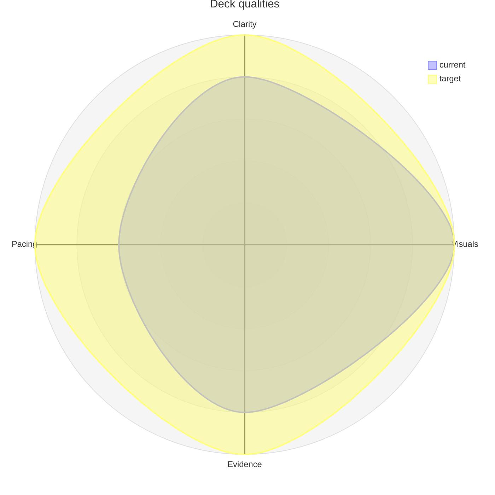
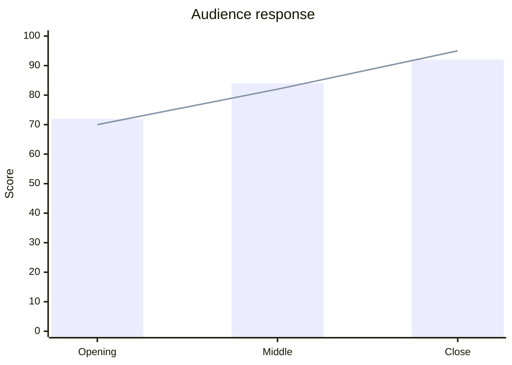

# Mermaid diagrams guide

SuperDeck renders supported [Mermaid](https://mermaid.js.org/) fences directly
in Flutter. No plugin registration, browser installation, generated image, or
build-time asset step is required.

Add a fenced block to `slides.md`:

````markdown

```mermaid
graph TD
  A[Write slides] --> B[Run SuperDeck]
  B --> C[Present]
```
````

The diagram participates in normal slide layout and is captured with the rest
of the Flutter widget tree for thumbnails, screenshots, and PDF export.

## Supported diagram types

SuperDeck supports:

- flowcharts
- sequence diagrams
- pie charts
- Gantt charts
- timelines
- Kanban boards
- radar charts
- XY charts

Class, state, journey, entity-relationship, mind map, Git graph, and other
Mermaid diagram families are not supported.

## Flowcharts

Use `graph` or `flowchart` with `TD`, `TB`, `BT`, `LR`, or `RL` direction:


```mermaid
flowchart LR
  Draft[Draft] --> Review{Approved?}
  Review -->|Yes| Present[Present]
  Review -->|No| Draft
```

## Sequence diagrams


```mermaid
sequenceDiagram
  participant Author
  participant SuperDeck
  Author->>SuperDeck: Load slides.md
  SuperDeck-->>Author: Paint presentation
```

## Pie charts


```mermaid
pie
  title Presentation content
  "Narrative" : 50
  "Diagrams" : 30
  "Examples" : 20
```

## Gantt charts


```mermaid
gantt
  title Launch plan
  dateFormat YYYY-MM-DD
  Outline :done, outline, 2025-01-06, 2d
  Build deck :active, deck, 2025-01-08, 4d
  Present :milestone, present, 2025-01-12, 0d
```

## Timelines


```mermaid
timeline
  title Product evolution
  2024 : Prototype
  2025 : Beta
       : First customers
  2026 : General availability
```

## Kanban boards


```mermaid
kanban
  todo[To Do]
    task1[Write narrative]
  doing[In Progress]
    task2[Design diagrams]
  done[Done]
    task3[Choose theme]
```

## Radar charts

Radar charts use the `radar-beta` header:


```mermaid
radar-beta
  title Deck qualities
  axis Clarity, Visuals, Evidence, Pacing
  curve current{4, 5, 4, 3}
  curve target{5, 5, 5, 5}
```

## XY charts

XY charts accept bar and line series:


```mermaid
xychart-beta
  title "Audience response"
  x-axis [Opening, Middle, Close]
  y-axis "Score" 0 --> 100
  bar [72, 84, 92]
  line [70, 82, 95]
```

## Layout and appearance

Diagrams adapt to the width assigned to their Markdown block and keep their
natural calculated height. SuperDeck makes the renderer background transparent
so the slide background remains visible. Diagram colors follow the app's light
or dark Flutter theme.

For dense diagrams, give the block more horizontal space or simplify the
source. A diagram inside a narrow multi-column section has less room than the
same diagram in a full-width section.

The previous JavaScript configuration map, browser launch options, Mermaid
`init` directives, custom CSS, and PNG viewport settings do not apply to the
runtime renderer.

## Errors and troubleshooting

Mermaid parsing now happens in the Flutter app rather than during
`superdeck build`. Invalid syntax or an unsupported diagram type displays an
inline error card on the slide and in static exports.

When a diagram shows an error:

1. Check that its first line names one of the supported diagram types.
2. Reduce the source to a minimal supported example.
3. Compare the syntax with the examples on this page.
4. Check the presentation at the same block size used by the final slide.

The official Mermaid live editor supports more syntax than SuperDeck's runtime
renderer, so success there does not guarantee that a diagram works in
SuperDeck.
