# Mermaid diagrams guide

SuperDeck renders supported [Mermaid](https://mermaid.js.org/) fences directly
in Flutter. No plugin registration, browser installation, generated image, or
build-time asset step is required.

Add a fenced block to `slides.md`:

````markdown
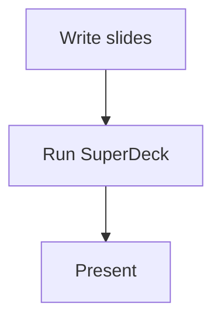
```mermaid
graph TD
  A[Write slides] --> B[Run SuperDeck]
  B --> C[Present]
```
````

The diagram participates in normal slide layout and is captured with the rest
of the Flutter widget tree for thumbnails, screenshots, and PDF export.

## Supported diagram types

SuperDeck renders every diagram family the Dart Mermaid port supports,
including:

- flowcharts and sequence diagrams
- class, state, entity-relationship and user-journey diagrams
- pie, Gantt, XY, radar and quadrant charts
- timelines, Kanban boards, mind maps and Git graphs
- C4, architecture, requirement, packet, sankey, block and treemap diagrams

Diagram families are ported by hand from Mermaid's own grammars, so a diagram
that renders on mermaid.js can still be rejected here, and layout is not
pixel-identical. Anything that is rejected says so on the slide, with the line
it failed on — nothing is dropped silently.

## Flowcharts

Use `graph` or `flowchart` with `TD`, `TB`, `BT`, `LR`, or `RL` direction:

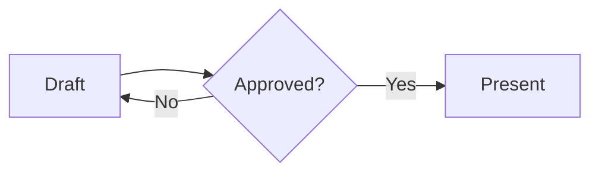
```mermaid
flowchart LR
  Draft[Draft] --> Review{Approved?}
  Review -->|Yes| Present[Present]
  Review -->|No| Draft
```

## Sequence diagrams

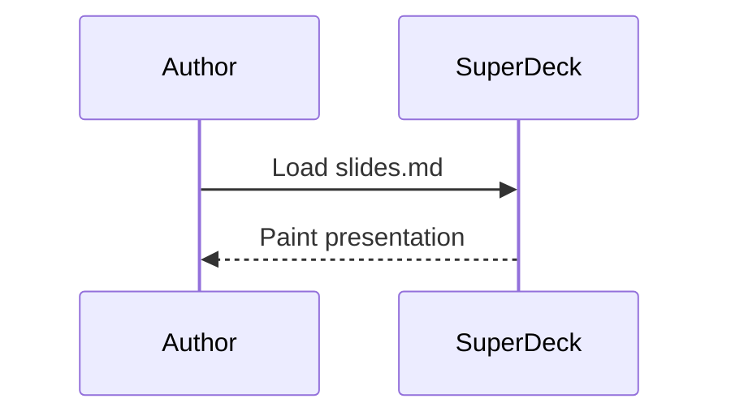
```mermaid
sequenceDiagram
  participant Author
  participant SuperDeck
  Author->>SuperDeck: Load slides.md
  SuperDeck-->>Author: Paint presentation
```

## Pie charts

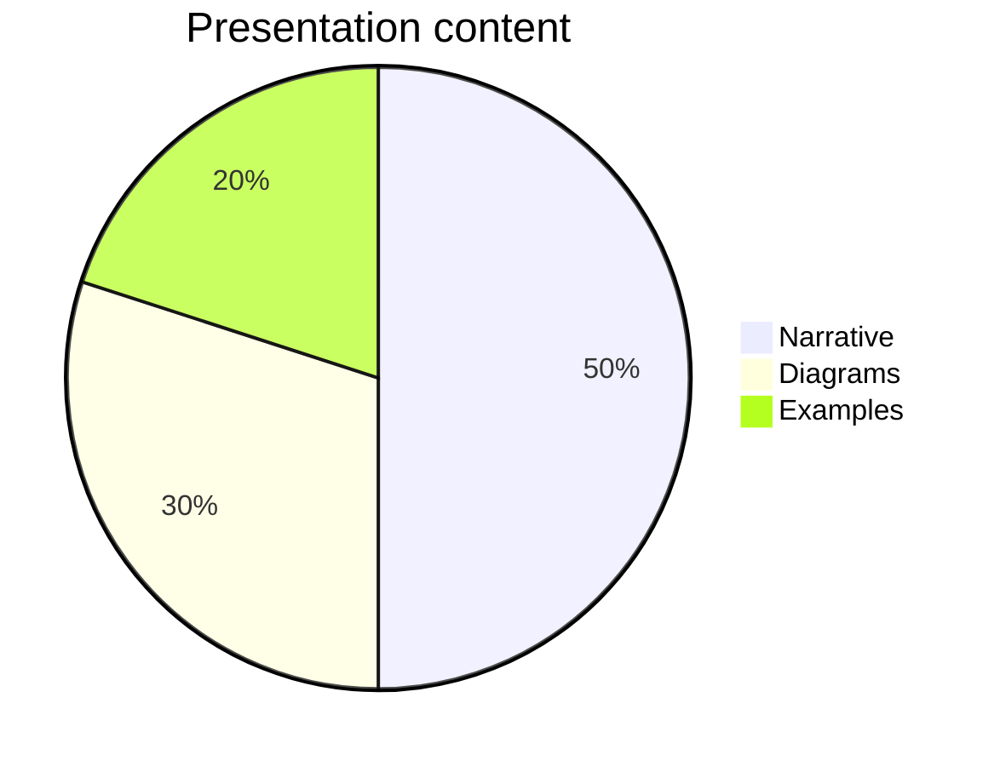
```mermaid
pie
  title Presentation content
  "Narrative" : 50
  "Diagrams" : 30
  "Examples" : 20
```

## Gantt charts

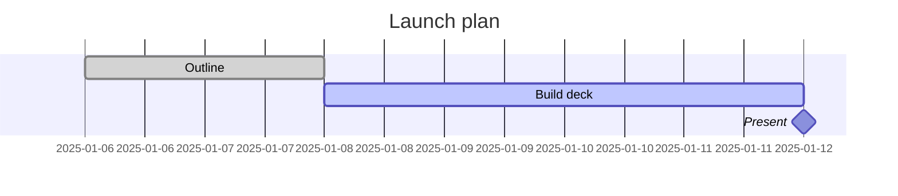
```mermaid
gantt
  title Launch plan
  dateFormat YYYY-MM-DD
  Outline :done, outline, 2025-01-06, 2d
  Build deck :active, deck, 2025-01-08, 4d
  Present :milestone, present, 2025-01-12, 0d
```

## Timelines

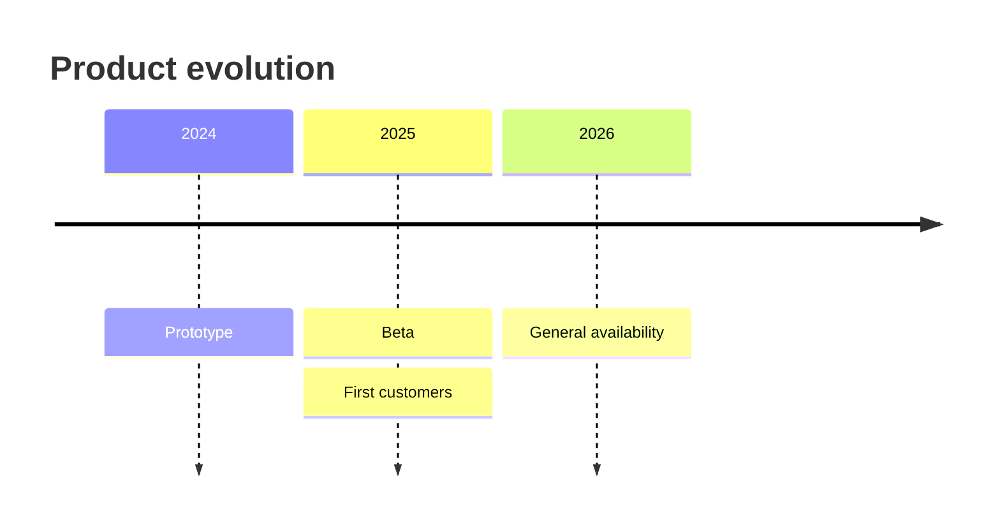
```mermaid
timeline
  title Product evolution
  2024 : Prototype
  2025 : Beta
       : First customers
  2026 : General availability
```

## Kanban boards

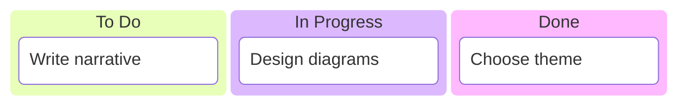
```mermaid
kanban
  todo[To Do]
    task1[Write narrative]
  doing[In Progress]
    task2[Design diagrams]
  done[Done]
    task3[Choose theme]
```

## Radar charts

Radar charts use the `radar-beta` header:

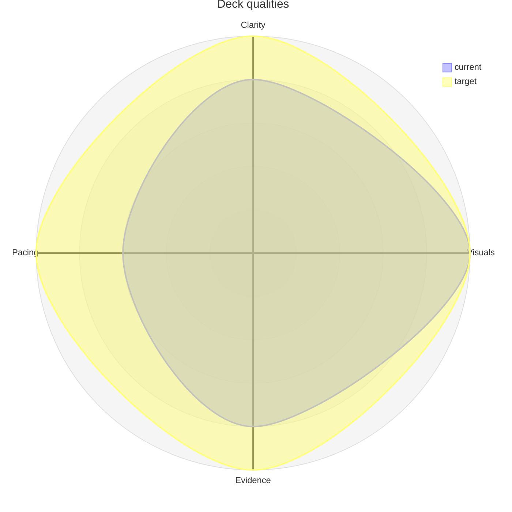
```mermaid
radar-beta
  title Deck qualities
  axis Clarity, Visuals, Evidence, Pacing
  curve current{4, 5, 4, 3}
  curve target{5, 5, 5, 5}
```

## XY charts

XY charts accept bar and line series:

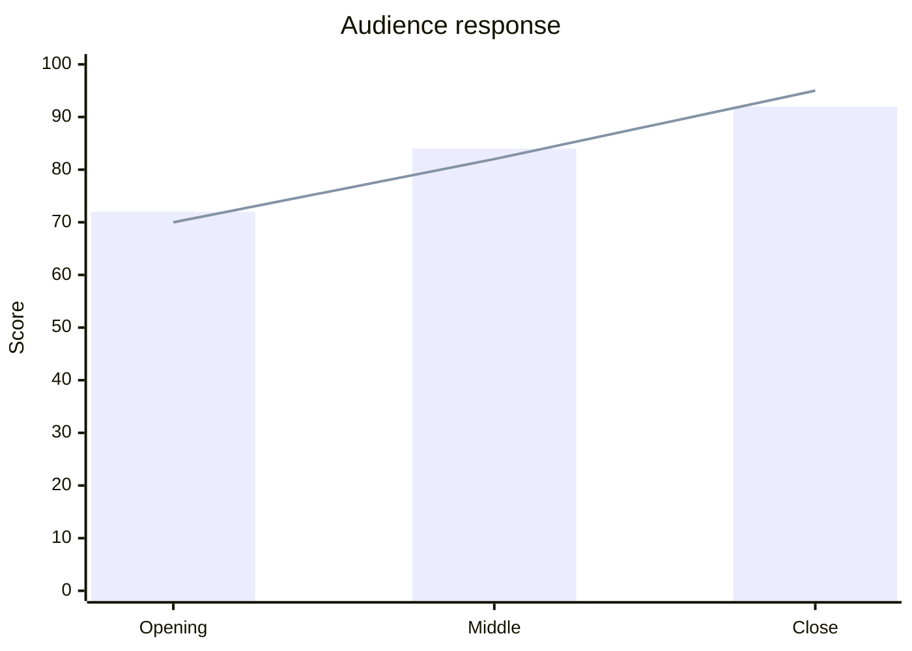
```mermaid
xychart-beta
  title "Audience response"
  x-axis [Opening, Middle, Close]
  y-axis "Score" 0 --> 100
  bar [72, 84, 92]
  line [70, 82, 95]
```

## Class, state, ER and journey diagrams

````markdown
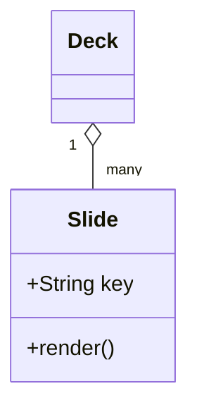
```mermaid
classDiagram
  Deck "1" o-- "many" Slide
  Slide : +String key
  Slide : +render()
```
````

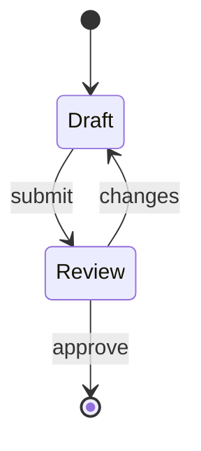
```mermaid
stateDiagram-v2
  [*] --> Draft
  Draft --> Review: submit
  Review --> Draft: changes
  Review --> [*]: approve
```

## Layout and appearance

Diagrams scale down to the width assigned to their Markdown block and keep
their natural aspect ratio. SuperDeck makes the renderer background
transparent so the slide background remains visible, and derives diagram
colours from the app's Material colour scheme, so a diagram follows the deck's
light or dark theme.

Diagram nodes are exposed to screen readers and browser automation, so a slide
with a diagram is not an unlabelled picture.

`%%{init: ...}%%` directives and YAML frontmatter configuration are read, so
per-diagram theme and layout options work, including `look: handDrawn` and the
ELK layout engine.

For dense diagrams, give the block more horizontal space or simplify the
source. A diagram inside a narrow multi-column section has less room than the
same diagram in a full-width section.

The build plugin's JavaScript configuration map, browser launch options,
custom CSS, and PNG viewport settings have no runtime counterpart.

## Errors and troubleshooting

Mermaid parsing happens in the Flutter app rather than during
`superdeck build`. Invalid syntax or an unknown diagram type displays an
inline error card on the slide naming the line that failed, and the same
failure stops a PDF export rather than writing a page with the diagram
missing.

When a diagram shows an error:

1. Check that its first line names one of the supported diagram types.
2. Reduce the source to a minimal supported example.
3. Compare the syntax with the examples on this page.
4. Check the presentation at the same block size used by the final slide.

The official Mermaid live editor is the reference implementation. A diagram
that works there usually works here, but the Dart port is a hand-written
re-implementation: when the two disagree, the slide shows the error rather
than a half-drawn diagram.
