```mermaid
sequenceDiagram
  participant Customer as 🧑 Customer
  participant Frontend as 💻 Frontend
  participant API as 🔗 API
  participant Database as 🗄️ Database
  
  Customer->>Frontend: Login Request
  Frontend->>API: POST /auth/login
  API->>Database: Verify Credentials
  Database-->>API: User Data
  API-->>Frontend: JWT Token
  Frontend-->>Customer: Login Success
  
  Note over Customer,Database: Authentication Flow
  
  Customer->>Frontend: Request Data
  Frontend->>API: GET /data (with token)
  API->>Database: Query Data
  Database-->>API: Results
  API-->>Frontend: JSON Response
  Frontend-->>Customer: Display Data
```

```mermaid
flowchart TD
  subgraph Frontend ["🖥️ Frontend"]
    UI[User Interface]
    State[State Management]
    Router[Navigation]
  end
  
  subgraph Backend ["⚙️ Backend"]
    API[REST API]
    Auth[Authentication]
    DB[(Database)]
  end
  
  UI --> API
  State --> API
  Router --> State
  API --> Auth
  API --> DB
```

# Mermaid Diagrams Guide

SuperDeck includes built-in support for [Mermaid](https://mermaid.js.org/) diagrams, allowing you to create flowcharts, sequence diagrams, class diagrams, and more using simple text syntax. During the build process, mermaid diagrams are automatically rendered to high-quality images.

## Supported Diagram Types

- **Flowcharts** - Process flows and decision trees
- **Sequence Diagrams** - Interactions between participants over time
- **Class Diagrams** - Object-oriented class relationships
- **State Diagrams** - State transitions and workflows
- **Pie Charts** - Data visualization
- **Journey Maps** - User experience flows
- **Gantt Charts** - Project timelines
- **Entity-Relationship Diagrams** - Database relationships

## Basic Usage

Create a mermaid diagram by using a fenced code block with the `mermaid` language:

````markdown

````

## Flowcharts

### Basic Flowchart

````markdown

````

### Node Shapes

SuperDeck supports all Mermaid node shapes:

````markdown

````

### Direction Options

Control flowchart direction:

- `TD` or `TB` - Top to Bottom (default)
- `BT` - Bottom to Top  
- `LR` - Left to Right
- `RL` - Right to Left

````markdown

````

## Sequence Diagrams

Perfect for showing interactions between different systems or users:

````markdown

````

### Sequence Diagram Features

- **Participants**: Define actors in the sequence
- **Messages**: Arrows between participants (`->>`, `-->>`, `-x`, `--x`)
- **Notes**: Add explanatory text (`Note over`, `Note left of`, `Note right of`)
- **Loops**: Repetitive actions (`loop`, `end`)
- **Alternatives**: Conditional flows (`alt`, `else`, `end`)

## Class Diagrams

Show object-oriented relationships:

````markdown
```mermaid
classDiagram
  class PresentationController {
    +PresentationOptions options
    +List~Slide~ slides
    +int currentIndex
    +initialize()
    +nextSlide()
    +previousSlide()
    +goToSlide(int index)
  }
  
  class Slide {
    +String key
    +SlideOptions options
    +List~SectionBlock~ sections
    +List~String~ comments
    +render()
  }
  
  class SlideOptions {
    +String? title
    +String? style  
    +Map~String, Object?~ args
  }
  
  PresentationController "1" --> "*" Slide
  Slide "1" --> "1" SlideOptions
  
  <<interface>> Renderable
  Slide ..|> Renderable
```
````

## State Diagrams

Model state transitions and workflows:

````markdown

````

## Pie Charts

Visualize data proportions:

````markdown

````

## Journey Maps

Show user experience flows:

````markdown

````

## Gantt Charts

Project timeline visualization:

````markdown

````

## Entity-Relationship Diagrams

Database schema visualization:

````markdown

````

## Styling and Theming

SuperDeck provides a **simple 4-color theme system** for customizing all Mermaid diagrams with just a few values.

### Simple Theme Customization

Define your theme with just 4 colors:

```dart
final theme = MermaidTheme(
  background: '#0b0f14',  // Canvas color
  primary: '#0ea5e9',     // Main accent (nodes, highlights)
  text: '#e2e8f0',        // Text color
  darkMode: true,         // Dark or light derivations
);

final generator = MermaidGenerator(theme: theme);
```

### How It Works

From your 4 colors, SuperDeck automatically derives **90+ theme variables**:

- **Secondary/Tertiary colors** - Mermaid rotates hue for color harmony
- **Node backgrounds** - Slightly lighter/darker than canvas
- **Borders** - Darker shade of primary
- **Lines/arrows** - Muted text color
- **12-color palette** - For pie charts, evenly spaced hues

All diagram types (flowcharts, sequence, pie, state, class, gantt) use the same consistent color palette.

### Preset Themes

Use built-in presets for quick setup:

```dart
// Dark theme (default) - perfect for presentations
MermaidGenerator(theme: MermaidTheme.dark);

// Light theme - for daytime presentations or printing
MermaidGenerator(theme: MermaidTheme.light);
```

### Dark vs Light Mode

The `darkMode` flag tells Mermaid how to derive colors:

- **`darkMode: true`** → Light text on dark backgrounds (default)
- **`darkMode: false`** → Dark text on light backgrounds

```dart
// Dark presentation theme
MermaidTheme(
  background: '#1a1a2e',
  primary: '#00ff88',
  text: '#ffffff',
  darkMode: true,
);

// Light presentation theme
MermaidTheme(
  background: '#ffffff',
  primary: '#0066FF',
  text: '#1a1a1a',
  darkMode: false,
);
```

### Advanced: Per-Diagram Custom Styling

You can still override styling for individual diagrams using Mermaid's theming directives. Add configuration at the top of your diagram:

````markdown

````

## Advanced Features

### Subgraphs

Group related nodes together:

````markdown

````

### Links and Interactions

Add clickable links to diagram elements:

````markdown

````

### Comments

Add documentation to your diagrams:

````markdown

````

## Build Process

When you run `superdeck build`, mermaid diagrams are automatically:

1. **Detected** in your markdown slides
2. **Rendered** to high-quality PNG images
3. **Cached** to avoid regenerating unchanged diagrams
4. **Replaced** with image references in your presentation

Generated images are saved to `.superdeck/assets/` and automatically included in your presentation.

## Troubleshooting

### Common Issues

1. **Syntax Errors**: Validate your Mermaid syntax using the [official live editor](https://mermaid.live/)
2. **Missing Images**: Check build output for any generation errors
3. **Complex Diagrams**: Very large diagrams may timeout - try breaking them into smaller parts

### Debugging

Use verbose mode to see detailed build information:

```bash
superdeck build --verbose
```

## Best Practices

### Design Guidelines

1. **Keep it Simple**: Avoid overly complex diagrams
2. **Use Colors Wisely**: Consider presentation background when styling
3. **Readable Text**: Ensure text is large enough for presentation viewing
4. **Consistent Style**: Use similar styling across all diagrams

### Performance Tips

1. **Keep Diagrams Simple**: Avoid overly complex diagrams for better readability
2. **Test Early**: Build regularly to catch syntax issues
3. **Use Caching**: Identical diagrams are cached automatically

### Accessibility

- Generated images include descriptive alt text
- Default theme provides good contrast for presentations
- Text sizes are optimized for presentation viewing