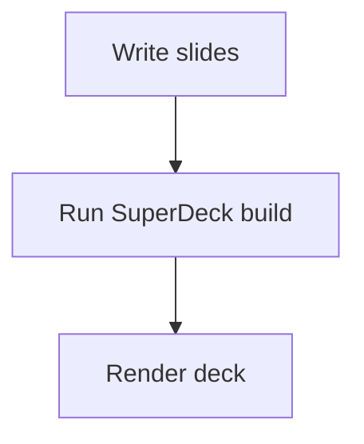

# Plugin guide

SuperDeck plugins are small Dart packages or local helpers that extend a deck
without adding every possible feature to the base `superdeck` package.

There are two plugin surfaces:

- **Runtime plugins** register commands in the SuperDeck shell. Use these for
  commands that need the current `DeckController`, such as exporting a PDF or
  opening a custom panel.
- **Build plugins** transform Markdown content before the Flutter app renders
  it. Use these for generated assets, syntax transforms, or content that must
  be prepared during `superdeck_cli build`.

Custom widgets are still the right tool for slide content that renders directly
in Flutter. Use a plugin when you need to package a reusable shell action or
build-time transform.

## Use the PDF plugin

`superdeck_pdf` is a runtime plugin. It contributes an Export PDF command to
the deck shell and opens a PDF export flow using the current deck state.

Add it to the Flutter app:

```yaml
dependencies:
  superdeck: ^1.0.0
  superdeck_pdf: ^1.0.0
```

Register the plugin in `SuperDeckApp`:

```dart
import 'package:flutter/widgets.dart';
import 'package:superdeck/superdeck.dart';
import 'package:superdeck_pdf/superdeck_pdf.dart';

Future<void> main() async {
  WidgetsFlutterBinding.ensureInitialized();
  await SuperDeckApp.initialize();

  runApp(
    SuperDeckApp(
      options: DeckOptions(),
      plugins: const [
        PdfPlugin(),
      ],
    ),
  );
}
```

Pass a custom saver when the app needs to upload, persist, or intercept the PDF
bytes:

```dart
SuperDeckApp(
  options: DeckOptions(),
  plugins: [
    PdfPlugin(
      options: PdfExportOptions(
        pdfSaver: (bytes) async {
          // Upload or persist the generated PDF bytes.
          return true;
        },
      ),
    ),
  ],
);
```

Set `fileName` when the default platform save flow should use a different
download or save-dialog name.

## Use the Mermaid plugin

`superdeck_mermaid` is a build plugin. It finds fenced Mermaid code blocks,
renders them to PNG files under the active SuperDeck build output directory,
and replaces the fence with a Markdown image reference before the deck is saved.

Add it to the project that runs the SuperDeck build:

```yaml
dev_dependencies:
  superdeck_cli: ^1.0.0
  superdeck_mermaid: ^1.0.0
```

Create a custom runner, for example `tool/superdeck.dart`:

```dart
import 'dart:io';

import 'package:superdeck_cli/runner.dart';
import 'package:superdeck_mermaid/superdeck_mermaid.dart';

Future<void> main(List<String> args) async {
  final exitCode = await SuperDeckRunner(
    plugins: [
      MermaidBuildPlugin(),
    ],
  ).run(args);

  exit(exitCode);
}
```

Run builds through the custom runner:

```bash
dart run tool/superdeck.dart build --watch
```

Then author Mermaid in `slides.md`:

````markdown
@block


````

Customize Mermaid rendering by passing configuration to the plugin:

```dart
SuperDeckRunner(
  plugins: [
    MermaidBuildPlugin(
      configuration: {
        'theme': 'forest',
        'viewportWidth': 1280,
        'viewportHeight': 780,
      },
    ),
  ],
);
```

See the [Mermaid diagrams guide](/guides/mermaid-diagrams) for supported
diagram syntax and authoring examples.

When a custom `MermaidGenerator` is passed to `MermaidBuildPlugin`, the plugin
disposes that generator from its own `dispose()` method.

## Create a runtime plugin

Runtime plugins extend `DeckRuntimePlugin` and register one or more
`DeckAction` objects. Each action needs a stable `id`, a user-facing `label`,
an `IconData`, and an `onPressed` callback. The callback receives the current
`BuildContext` and `DeckController`.

```dart
import 'package:flutter/material.dart';
import 'package:superdeck/superdeck.dart';

final class SpeakerToolsPlugin extends DeckRuntimePlugin {
  const SpeakerToolsPlugin();

  @override
  String get id => 'example.speaker-tools';

  @override
  List<DeckAction> get actions {
    return [
      DeckAction(
        id: 'example.current-slide',
        label: 'Show current slide',
        icon: Icons.info_outline,
        onPressed: (context, deck) {
          final slide = deck.presentation.currentSlide.value;
          final title = slide?.options.title;
          final label = title == null || title.isEmpty
              ? slide?.key ?? 'Untitled slide'
              : title;

          ScaffoldMessenger.of(context).showSnackBar(
            SnackBar(content: Text('Current slide: $label')),
          );
        },
      ),
    ];
  }
}
```

Register it exactly like any other runtime plugin:

```dart
SuperDeckApp(
  options: DeckOptions(),
  plugins: const [
    SpeakerToolsPlugin(),
  ],
);
```

Use runtime plugins when the plugin needs current slide state, navigation state,
thumbnail state, or access to Flutter UI.

## Create a build plugin

Build plugins extend `DeckBuildPlugin`. A build plugin transforms each
`ContentBlock` after Markdown parsing and before SuperDeck writes build output.
Plugins run in the order passed to `SuperDeckRunner`.

This example replaces a small custom marker with a GitHub-style note:

```dart
import 'package:superdeck_builder/superdeck_builder.dart';
import 'package:superdeck_core/superdeck_core.dart' show ContentBlock;

/// Rewrites inline callout markers into Markdown note blocks.
final class CalloutBuildPlugin extends DeckBuildPlugin {
  /// Creates a callout transform plugin.
  const CalloutBuildPlugin();

  @override
  String get id => 'example.callout';

  @override
  ContentBlock transformContentBlock(
    ContentBlock block,
    DeckBuildContext context,
  ) {
    final content = block.content.replaceAllMapped(
      RegExp(r'::callout\[(.*?)\]'),
      (match) => '> [!NOTE]\n> ${match.group(1)}',
    );

    return content == block.content ? block : block.copyWith(content: content);
  }
}
```

Register it in a custom runner:

```dart
import 'dart:io';

import 'package:superdeck_cli/runner.dart';

Future<void> main(List<String> args) async {
  final exitCode = await SuperDeckRunner(
    plugins: [
      CalloutBuildPlugin(),
    ],
  ).run(args);

  exit(exitCode);
}
```

Then use it in `slides.md`:

```markdown
@block

::callout[This slide is generated from a custom build plugin.]
```

Build plugins can also write generated files. Use `DeckBuildContext.outputFile`
to create a file inside the active build output directory, then use
`DeckBuildContext.assetPath` to reference that file from transformed Markdown:

```dart
import 'package:superdeck_builder/superdeck_builder.dart';
import 'package:superdeck_core/superdeck_core.dart' show ContentBlock;

/// Writes a generated text asset and links it from transformed Markdown.
final class TextAssetPlugin extends DeckBuildPlugin {
  /// Creates a text asset plugin.
  const TextAssetPlugin();

  @override
  String get id => 'example.text-asset';

  @override
  Future<ContentBlock> transformContentBlock(
    ContentBlock block,
    DeckBuildContext context,
  ) async {
    final outputFile = context.outputFile('generated/example.txt');
    await outputFile.parent.create(recursive: true);
    await outputFile.writeAsString('Generated for ${context.slideKey}');

    final assetPath = context.assetPath('generated/example.txt');
    return block.copyWith(
      content: '${block.content}\n\nGenerated asset: `$assetPath`',
    );
  }
}
```

Keep build plugins deterministic. Cache expensive work by hashing the source
content, write files through `DeckBuildContext.outputFile`, and throw
`DeckFormatException` when the error should point back to invalid slide content.

## Package a plugin

For one presentation, plugin helpers can live in `lib/` or `tool/`. For reuse,
publish a small Dart or Flutter package:

- Use a Flutter package when the plugin exports runtime plugins or widgets.
- Use a Dart package when the plugin only exports build plugins.
- Export one small public API, such as `PdfPlugin` or `MermaidBuildPlugin`.
- Keep heavy dependencies in the optional plugin package, not in base
  `superdeck`.
- Include tests for the public plugin class and the behavior it contributes.

## Choosing the right extension point

| Need | Use |
| --- | --- |
| Render custom slide content from `@name { ... }` | Custom widget |
| Add a command to the shell | Runtime plugin |
| Rewrite Markdown before rendering | Build plugin |
| Generate image, data, or cache files during build | Build plugin |
| Open a dialog using current deck state | Runtime plugin |

## Troubleshooting

- **Runtime command is not visible**: Make sure the plugin is included in
  `SuperDeckApp(plugins: [...])` and that the deck shell menu is open.
- **Build plugin does not run**: Make sure builds are run through the custom
  `SuperDeckRunner`, not the default CLI entrypoint.
- **Generated asset is missing**: Write it with `context.outputFile(...)` and
  reference it with `context.assetPath(...)`.
- **Plugin errors are hard to locate**: Throw `DeckFormatException` from build
  plugins when the failure comes from slide content.
- **Markdown output is malformed**: Print or test the transformed
  `ContentBlock.content` before debugging the Flutter runtime.
- **Mermaid rendering fails**: Validate the Mermaid syntax first, then run the
  build with `--verbose`. The generator needs a browser that `puppeteer` can
  launch in the build environment.

## Related reference

- [Plugin API reference](/reference/plugin-api)
- [Custom widgets guide](/guides/custom-widgets)
- [Builder API reference](/reference/builder-api)
- [CLI reference](/guides/cli-reference)
