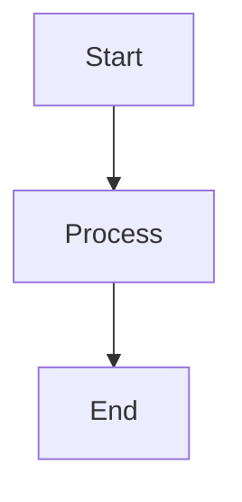

# SuperDeck Overview

Create beautiful, interactive presentations with Flutter and Markdown.

---

## What You Can Build

With SuperDeck, you can:

- **Write slides in Markdown** with live hot-reload during development
- **Embed interactive content** like DartPad playgrounds, Mermaid diagrams, and custom widgets
- **Style everything** with type-safe control over typography, colors, and themes
- **Deploy anywhere** Flutter runs: web, desktop, and mobile
- **Export to PDF** or publish directly to GitHub Pages

---

## Core Features

### Markdown Layout System

SuperDeck uses a powerful `@block` syntax for organizing slide content into flexible layouts:

````markdown
@section {
  flex: 2
}

@column {
  align: center
}

# Welcome to SuperDeck
Build presentations with Markdown and Flutter

@column {
  align: center
  flex: 1
}


````

**Core block types**

- `@section` – multi-column container with configurable flex ratios
- `@column` – display markdown content with alignment and scrolling
- `@widget` – custom registered Flutter widgets

**Built-in widgets** (use shorthand syntax like `@image { ... }`):

- `image` – images with fit options (`cover`, `contain`, `fill`, `fitWidth`, `fitHeight`)
- `dartpad` – embedded DartPad snippets with live editing
- `qrcode` – generate QR codes
- `mermaid` – render Mermaid diagrams

**Alignment options**: `top_left`, `top_center`, `top_right`, `center_left`, `center`, `center_right`, `bottom_left`, `bottom_center`, `bottom_right`

### Custom Widget Support

Register custom Flutter widgets and use them directly in Markdown:

```dart
SuperDeckApp(
  options: DeckOptions(
    widgets: const {
      'twitter': TwitterWidgetDefinition(),
    },
  ),
)
```

Use in Markdown:

````markdown
@twitter {
  username: flutterdev
  tweetId: 1234567890
}
````

SuperDeck calls `WidgetDefinition.parse()` with the block's arguments and then `WidgetDefinition.build()` to render your widget. For complex widgets, parse into a typed args class and validate with `Ack` (see the Custom Widgets guide).

### Markdown Extensions

**Hero animations** – CSS-like tags for seamless slide transitions:

````markdown
# My Title {.hero-title}
 {.hero-logo}
````

**GitHub alerts** – Native alert blocks with icons:

````markdown
> [!NOTE]
> This is an informational note

> [!WARNING]
> Proceed with caution

> [!CAUTION]
> Critical warning
````

**Mermaid diagrams** – Full support with automatic PNG rendering:

````markdown

````

**Code highlighting** – Syntax highlighting for supported grammars (Dart/JSON/YAML/Markdown) with a Dart fallback

**Standard Markdown** – Full CommonMark plus GitHub Flavored Markdown support

---

## Styling & Theming

### Comprehensive Styling API

Control every aspect of your presentation through the `SlideStyle` system:

```dart
final customStyle = SlideStyle(
  h1: TextStyler().style(
    TextStyleMix(fontSize: 48, color: Colors.purple),
  ),
  p: TextStyler().style(
    TextStyleMix(fontSize: 18, height: 1.5),
  ),
  code: MarkdownCodeblockStyle(
    textStyle: const TextStyle(fontFamily: 'Fira Code', color: Colors.white),
    container: BoxStyler(
      decoration: BoxDecorationMix(
        color: const Color(0xFF1E1E1E),
        borderRadius: BorderRadiusMix.all(Radius.circular(16)),
      ),
    ),
  ),
  blockContainer: BoxStyler(
    decoration: BoxDecorationMix(
      borderRadius: BorderRadiusMix.all(Radius.circular(16)),
    ),
  ),
);
```

Import `package:flutter/material.dart` and `package:mix/mix.dart` to access the builders above. Use `customStyle` as `DeckOptions.baseStyle` or as a named style variant.

**Styleable elements**

- Typography: `h1`–`h6`, paragraphs, blockquotes
- Code: code blocks and inline code with syntax highlighting
- Markdown primitives: tables, lists, checkboxes
- Alerts: note, tip, important, warning, caution
- Layout: containers, images, flex configurations

### Theme System

- **Mix 2.0 integration** – Type-safe, composable styles
- **Google Fonts support** – Custom typography with automatic loading
- **Scoped variants** – Apply style variants per slide with front matter (`style: recap`)

---

## How It Works

SuperDeck uses a two-stage build pipeline:

1. **Build time**: The CLI parses your `slides.md` file, renders Mermaid diagrams to images, and generates asset manifests
2. **Runtime**: Flutter renders the parsed slide data as widgets with full styling control

This approach gives you fast hot-reload during development while ensuring optimized assets in production.

---

## Next Steps

- Learn how to author slides with the [Markdown Authoring Guide](./markdown-authoring)
- Dive deeper into block behavior in the [Block Types reference](../reference/block-types)
- Explore automation and publishing with the [CLI Reference](./cli-reference)
