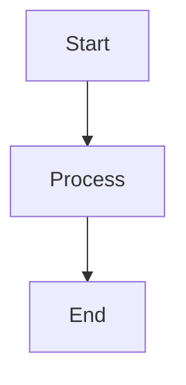

# SuperDeck Overview

SuperDeck pairs the flexibility of Flutter with Markdown authoring so you can ship beautiful, interactive presentations across web, desktop, and mobile without rebuilding slides for every platform.

---

## What SuperDeck Does

SuperDeck transforms Markdown files into fully rendered Flutter presentations with:

- **Two-stage build pipeline** – Parse Markdown at build time, render Flutter widgets at runtime
- **Rich markdown extensions** – Block-based layouts, custom widgets, hero animations, alerts, Mermaid diagrams, and more
- **Flexible styling system** – Type-safe control over typography, colors, spacing, and themes using Mix builders
- **Asset management** – Build-time Mermaid rendering with content-hash caching plus hooks for custom generators
- **Export & publishing** – PDF export and one-command deployment to GitHub Pages

---

## Core Features

### Markdown Layout System

SuperDeck uses a powerful `@block` syntax for organizing slide content into flexible layouts:

````markdown
@section {
  flex: 2
}

@column {
  align: center
}

# Welcome to SuperDeck
Build presentations with Markdown and Flutter

@column {
  align: center
  flex: 1
}


````

**Available blocks**

- `@section` – multi-column container with configurable flex ratios
- `@column` – display markdown content with alignment and scrolling
- `@image` – images with fit options (`cover`, `contain`, `fill`, `fitWidth`, `fitHeight`)
- `@dartpad` – embedded DartPad snippets with live editing
- `@widget` – custom registered Flutter widgets

**Alignment options**: `topLeft`, `topCenter`, `topRight`, `centerLeft`, `center`, `centerRight`, `bottomLeft`, `bottomCenter`, `bottomRight`

### Custom Widget Support

Register custom Flutter widgets and use them directly in Markdown:

```dart
SuperDeckApp(
  options: DeckOptions(
    widgets: {
      'twitter': (args) => TwitterWidget(
        username: args.getString('username'),
        tweetId: args.getString('tweetId'),
      ),
      'chart': (args) => DataChart(
        data: args.getStringList('values'),
      ),
    },
  ),
)
```

Use in Markdown:

````markdown
@twitter {
  username: flutterdev
  tweetId: 1234567890
}
````

**Type-safe widget argument helpers**

- `getString()`, `getInt()`, `getDouble()`, `getBool()` – required typed values
- `getStringOrNull()`, `getIntOrNull()` – nullable variants
- `getStringOr(key, defaultValue)` – default fallbacks
- `getStringList()`, `getNested()` – lists and nested objects

### Markdown Extensions

**Hero animations** – CSS-like tags for seamless slide transitions:

````markdown
# My Title {.hero-title}
 {.hero-logo}
````

**GitHub alerts** – Native alert blocks with icons:

````markdown
> [!NOTE]
> This is an informational note

> [!WARNING]
> Proceed with caution

> [!CAUTION]
> Critical warning
````

**Mermaid diagrams** – Full support with automatic PNG rendering:

````markdown

````

**Code highlighting** – Syntax highlighting for supported grammars (Dart/JSON/YAML/Markdown) with a Dart fallback

**Standard Markdown** – Full CommonMark plus GitHub Flavored Markdown support

---

## Styling & Theming

### Comprehensive Styling API

Control every aspect of your presentation through the `SlideStyle` system:

```dart
final customStyle = SlideStyle(
  h1: TextStyler()
      .style(TextStyleMix(fontSize: 48, color: Colors.purple)),
  p: TextStyler()
      .style(TextStyleMix(fontSize: 18, height: 1.5)),
  code: MarkdownCodeblockStyle(
    textStyle: const TextStyle(fontFamily: 'Fira Code', color: Colors.white),
    container: BoxStyler()
        .color(const Color(0xFF1E1E1E))
        .padding(EdgeInsetsGeometryMix.all(24))
        .borderRadius(BorderRadiusMix.circular(16)),
  ),
  blockContainer: BoxStyler()
      .padding(EdgeInsetsGeometryMix.all(24))
      .borderRadius(BorderRadiusMix.circular(16)),
);
```

Import `package:flutter/material.dart` and `package:mix/mix.dart` to access the builders above; reuse `customStyle` as `DeckOptions.baseStyle` or as a named variant.

**Styleable elements**

- Typography: `h1`–`h6`, paragraphs, blockquotes
- Code: code blocks and inline code with syntax highlighting
- Markdown primitives: tables, lists, checkboxes
- Alerts: note, tip, important, warning, caution
- Layout: containers, images, flex configurations

### Theme System

- **Mix 2.0 integration** – Type-safe, composable styles
- **Google Fonts support** – Custom typography with automatic loading
- **Scoped variants** – Apply style variants per slide with front matter (`style: recap`)

---

## Next Steps

- Learn how to author slides with the [Markdown Authoring Guide](./markdown-authoring).
- Dive deeper into block behavior in the [Block Types reference](../reference/block-types).
- Explore automation and publishing with the [CLI Reference](./cli-reference).
