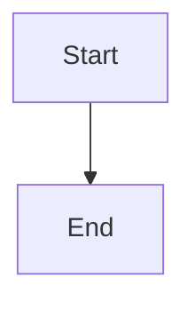

# Block types reference

SuperDeck has 3 core block types. Built-in widgets (`image`, `dartpad`, `qrcode`) use the same widget system as `@widget`.

## Common properties

All blocks support these properties:

### `align`
**Type:** String | **Default:** `center`

Controls content alignment:
- `topLeft`, `topCenter`, `topRight`
- `centerLeft`, `center`, `centerRight`
- `bottomLeft`, `bottomCenter`, `bottomRight`

### `flex`
**Type:** Number | **Default:** `1`

Controls relative sizing (`flex: 2` takes twice the space of `flex: 1`).

### `scrollable`
**Type:** Boolean | **Default:** `false`

Enables scrolling for overflow content.

## @block

Renders markdown content.

```markdown
@block {
  align: center
  flex: 2
  scrollable: true
}

# Your Content Here

- Lists
- Images
- Code blocks
- Tables
```

Use for text, code examples, lists, and tables.

## @section

Arranges child blocks horizontally.

```markdown
@section {
  align: topCenter
  flex: 1
}

@block
Left content

@block
Right content
```

**Properties:**
- `blocks` - Child blocks (auto-populated)

Use for multi-column layouts and side-by-side content.

**Three-column example:**
```markdown
@section

@block
Column 1

@block
Column 2

@block
Column 3
```

## @widget

Embeds custom Flutter widgets defined in your app.

```markdown
@widget {
  name: "customChart"
  arg1: "value1"
  arg2: 42
  config: { nested: "object" }
}
```

**Properties:**

### `name` (required)
**Type:** String

Widget name from `DeckPresentation.widgets`.

### Custom arguments
**Type:** JSON-serializable values

All additional properties pass to the widget builder.

**Setup in Flutter app:**
```dart
import 'package:flutter/widgets.dart';
import 'package:superdeck/superdeck.dart';

class CustomChartDefinition extends WidgetDefinition<Map<String, Object?>> {
  const CustomChartDefinition();

  @override
  Map<String, Object?> parse(Map<String, Object?> args) => args;

  @override
  Widget build(BuildContext context, Map<String, Object?> args) {
    final title = args['title'] as String? ?? 'Untitled Chart';
    final data = (args['data'] as List?)?.cast<Object?>() ?? const [];

    return Text('$title (${data.length} points)');
  }
}

SuperDeckApp(
  runtime: runtime,
);
```

Where `runtime` was created with:

```dart
final runtime = await SuperDeckRuntime.create(
  source: const DeckSource.local(
    slidesPath: 'slides.md',
    watch: true,
  ),
  runtimeConfig: const DeckRuntimeConfig(),
  presentation: DeckPresentation(
    widgets: const {
      'customChart': CustomChartDefinition(),
    },
  ),
);
```

**Note:** Use explicit (`@widget { name: "chart" }`) or shorthand (`@chart`) syntax. All properties pass to `WidgetDefinition.parse()` as `Map<String, Object?>`.

## Built-in widgets

Use shorthand syntax for these widgets.

### image

```markdown
@image {
  src: "path/to/image.png"
  fit: cover
  width: 400
  height: 300
}
```

**Properties:**
- `src` (required) - Asset path, absolute file path (`/Users/...` or `file:///...`), or URL
- `fit` - `fill`, `contain`, `cover`, `fitWidth`, `fitHeight`, `none`, `scaleDown` (default: `contain`)
- `width`, `height` - Fixed dimensions in pixels

### dartpad

```markdown
@dartpad {
  id: "d7b09149ffee07ec7c28"
  theme: dark
  run: true
}
```

**Properties:**
- `id` (required) - DartPad ID from dartpad.dev
- `theme` - `light` or `dark` (default: `light`)
- `embed` - Embed mode (default: `true`)
- `run` - Auto-run code (default: `true`)

### qrcode

Generates QR codes.

```markdown
@qrcode {
  text: "https://example.com"
  size: 200
}
```
**Properties:**
- `text` (required) - Text to encode
- `size` - Size in logical pixels (default: `200`)
- `errorCorrection` - `low`, `medium`, `high`, `highest` (default: `medium`)
- `backgroundColor`, `foregroundColor` - Hex colors (for example, `#ffffff`)

### Mermaid diagrams

Use a fenced code block with the `mermaid` language. SuperDeck renders Mermaid
to PNG during the local runtime build and publish flows.

````markdown

````

## Block syntax

### Basic syntax
```markdown
@blocktype {
  property1: value1
  property2: "string value"
  property3: 42
  property4: true
}
```

### Property types
- **String:** Use quotes for string values: `"hello world"`
- **Number:** No quotes: `42`, `3.14`
- **Boolean:** `true` or `false`
- **Object:** Nested braces: `{ key: "value" }`
- **Array:** Square brackets: `["item1", "item2"]`

### Common patterns

**Centered content:**
```markdown
@block {
  align: center
}
```

**Two-column layout:**
```markdown
@section

@block {
  flex: 1
}

@block {
  flex: 1
}
```

**Hero image:**
```markdown
@image {
  src: assets/hero.jpg
  fit: cover
  align: center
}
```

**Interactive demo:**
```markdown
@dartpad {
  id: "sample_id"
  theme: "dark"
  run: true
}
```

**Custom widget:**
```markdown
@widget {
  name: "twitterEmbed"
  username: "flutter_dev"
  tweetId: "1234567890"
}
```

## Best practices

1. Use `@block` for most content
2. Combine blocks in `@section` for rich layouts
3. Set explicit image dimensions to prevent shifts
4. Test DartPad IDs before presenting
5. Document custom widget arguments
6. Use consistent alignment patterns
