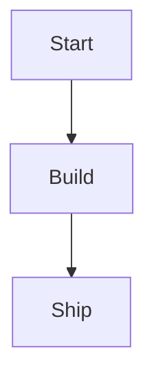

# Markdown syntax reference

Use this reference to look up syntax for front matter, blocks, and built-in widget arguments.

## Slide front matter

Each slide can include YAML front matter.

Supported keys:

- `title`: Slide title used in navigation and exports.
- `style`: Named style variant from `DeckTheme.styles`.
- `template`: Optional template name. Use `none` to opt out of a configured default template.
- Custom keys: Available through `slide.options.args['keyName']`.

Example:

````markdown
---
title: Product Vision
style: overview
owner: Platform Team
---
````

## Block types

SuperDeck supports three core block types.

| Block | Purpose | Key properties |
|---|---|---|
| `@section` | Container for horizontal layout | `flex`, `align`, `scrollable` |
| `@block` | Render markdown content | `flex`, `align`, `scrollable` |
| `@widget` | Embed custom Flutter widgets | `name` + custom args |

`@block` is the canonical markdown-content directive.

Built-in widgets (`image`, `dartpad`, `qrcode`) use the same widget syntax as `@widget`.

## Common block properties

### `flex`

- Type: number
- Default: `1`
- Meaning: relative size in the parent layout.

### `align`

- Type: string
- Default: `center`
- Values: `topLeft`, `topCenter`, `topRight`, `centerLeft`, `center`, `centerRight`, `bottomLeft`, `bottomCenter`, `bottomRight`

### `scrollable`

- Type: boolean
- Default: `false`
- Meaning: enable scrolling for overflow content.

## Built-in widgets

### `@image`

Example:

````markdown
@image {
  src: assets/value-loop.png
  fit: contain
  height: 420
}
````

Arguments:

- `src` (required): asset path, absolute file path, or URL.
- `fit`: `contain`, `cover`, `fill`, `fitWidth`, `fitHeight`, `none`, `scaleDown`.
- `width`: number.
- `height`: number.

### `@dartpad`

Example:

````markdown
@dartpad {
  id: "d7b09149b0843f2b9d09e081e3cfd5a3"
  theme: dark
  run: true
}
````

Arguments:

- `id` (required): DartPad snippet identifier.
- `theme`: `light` or `dark`.
- `embed`: boolean.
- `run`: boolean.

### `@qrcode`

Example:

````markdown
@qrcode {
  text: "https://superdeck.dev"
  size: 220
}
````

Arguments:

- `text` (required): content to encode.
- `size`: number.
- `errorCorrection`: `low`, `medium`, `high`, `highest`.
- `backgroundColor`: hex color string.
- `foregroundColor`: hex color string.

## Escaped directives

To render a literal directive marker instead of starting a block, prefix it with `_@`:

````markdown
_@section
_@block { flex: 2 }
````

The leading underscore is removed and the line is rendered as literal markdown text.

## Speaker notes

Use HTML comments for speaker notes:

````markdown
<!-- Mention migration risks here -->
````

Comments are extracted as slide notes and are not intended to be visible slide content.

## Markdown extensions

### Alerts

Use GitHub-style alert syntax:

````markdown
> [!NOTE]
> Additional context.

> [!WARNING]
> Important warning.
````

### Hero classes

Use classes to animate matching elements between slides:

````markdown
# Roadmap {.hero-title}
 {.hero-visual}
````

### Dart code blocks

Use fenced code blocks with `dart` as the language:

````markdown
```dart
void main() {
  print('Hello, SuperDeck');
}
```
````

In the standard local runtime build flow, fenced `dart` blocks are reformatted before the slide is rendered.

When you pass fenced-code options, use the braced header form:

````markdown
```dart {lineLength: 80}
void main() {
  print('Hello, SuperDeck');
}
```
````

The parser also accepts an unbraced form without options after the language token, but the braced form is the canonical syntax.

### Mermaid blocks

Use fenced code blocks with `mermaid` as the language:

````markdown

````
