# Mermaid diagrams guide

The `superdeck_mermaid` plugin can render [Mermaid](https://mermaid.js.org/) diagrams — flowcharts, sequence diagrams, class diagrams, and more — to PNG via a headless browser. This guide documents the Mermaid syntax the plugin supports.

> CLI/build integration is not wired up in this release. The plugin currently exposes a standalone `MermaidGenerator.render(syntax)` API that returns PNG bytes. See [Build process](#build-process) for status.

## Supported diagram types

- **Flowcharts** - Process flows and decision trees
- **Sequence Diagrams** - Interactions between participants over time
- **Class Diagrams** - Object-oriented class relationships
- **State Diagrams** - State transitions and workflows
- **Pie Charts** - Data visualization
- **Journey Maps** - User experience flows
- **Gantt Charts** - Project timelines
- **Entity-Relationship Diagrams** - Database relationships

## Basic usage

Create a mermaid diagram by using a fenced code block with the `mermaid` language:

````markdown
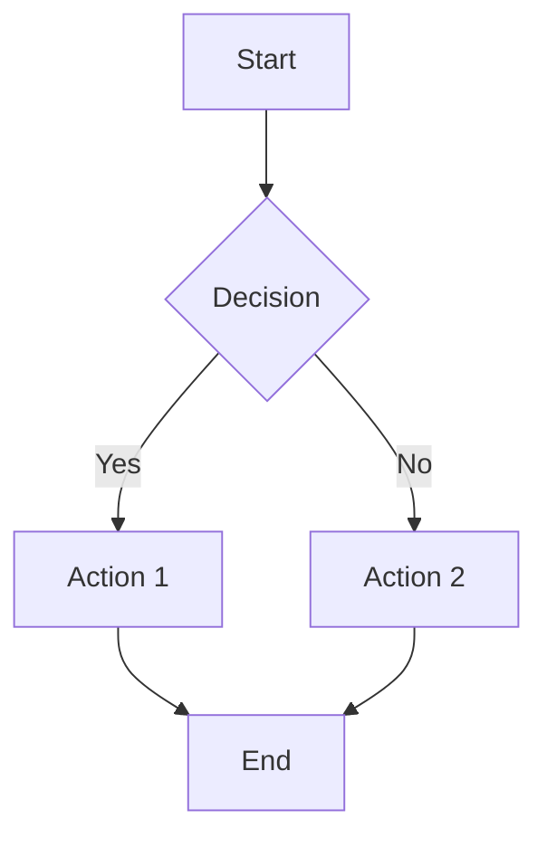
````

## Flowcharts

### Basic flowchart

````markdown
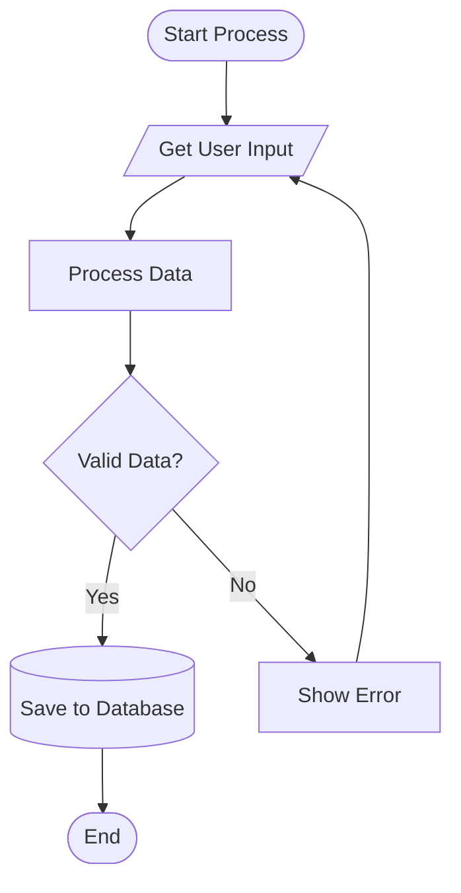
````

### Node shapes

SuperDeck supports all Mermaid node shapes:

````markdown
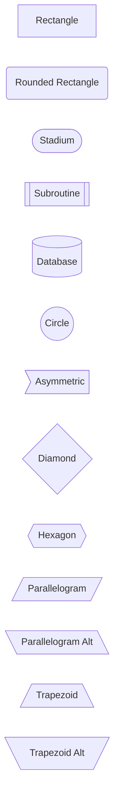
````

### Direction options

Control flowchart direction:

- `TD` or `TB` - Top to Bottom (default)
- `BT` - Bottom to Top  
- `LR` - Left to Right
- `RL` - Right to Left

````markdown
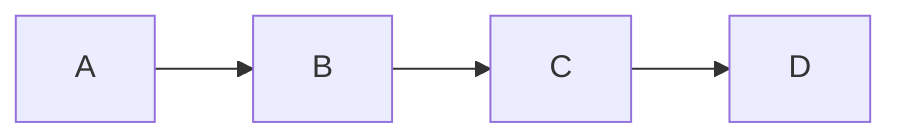
````

## Sequence diagrams

Perfect for showing interactions between different systems or users:

````markdown
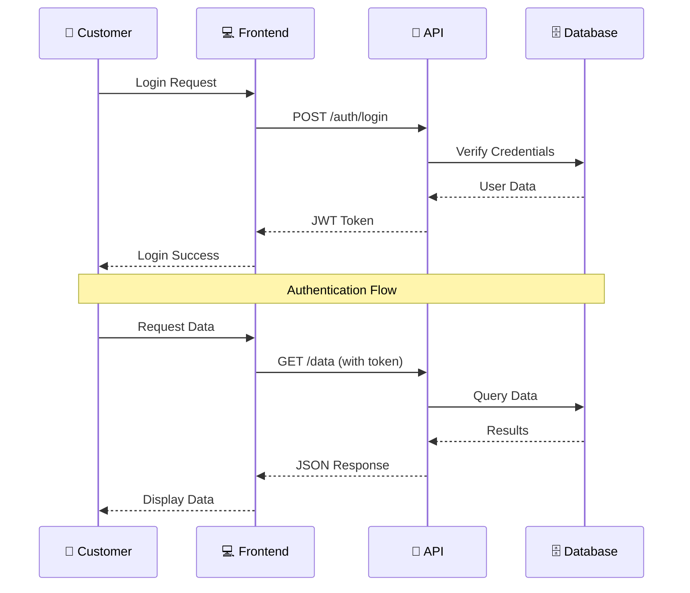
````

### Sequence diagram features

- **Participants**: Define actors in the sequence
- **Messages**: Arrows between participants (`->>`, `-->>`, `-x`, `--x`)
- **Notes**: Add explanatory text (`Note over`, `Note left of`, `Note right of`)
- **Loops**: Repetitive actions (`loop`, `end`)
- **Alternatives**: Conditional flows (`alt`, `else`, `end`)

## Class diagrams

Show object-oriented relationships:

````markdown
```mermaid
classDiagram
  class PresentationController {
    +DeckOptions options
    +List~Slide~ slides
    +int currentIndex
    +initialize()
    +nextSlide()
    +previousSlide()
    +goToSlide(int index)
  }
  
  class Slide {
    +String key
    +SlideOptions options
    +List~SectionBlock~ sections
    +List~String~ comments
    +render()
  }
  
  class SlideOptions {
    +String? title
    +String? style  
    +Map~String, Object?~ args
  }
  
  PresentationController "1" --> "*" Slide
  Slide "1" --> "1" SlideOptions
  
  <<interface>> Renderable
  Slide ..|> Renderable
```
````

## State diagrams

Model state transitions and workflows:

````markdown
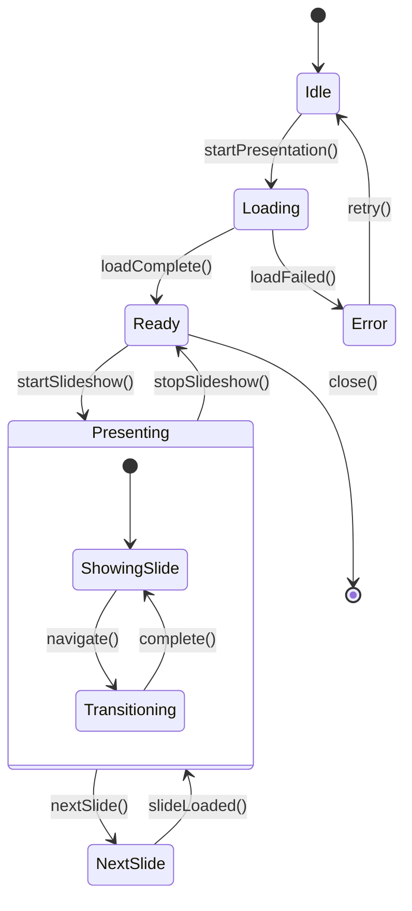
````

## Pie charts

Visualize data proportions:

````markdown
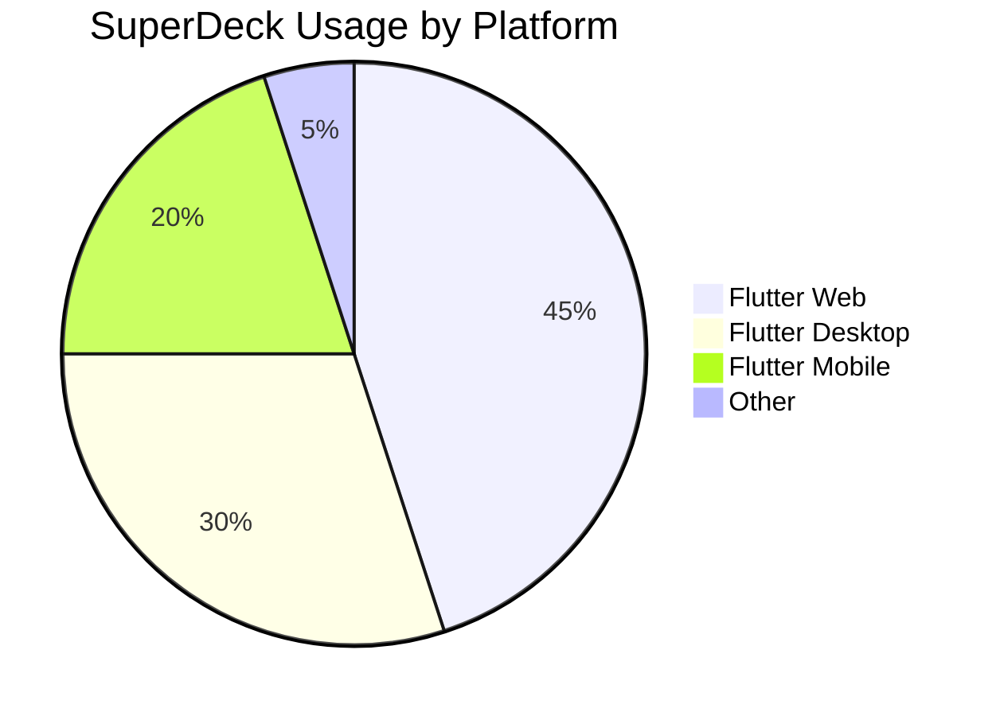
````

## Journey maps

Show user experience flows:

````markdown
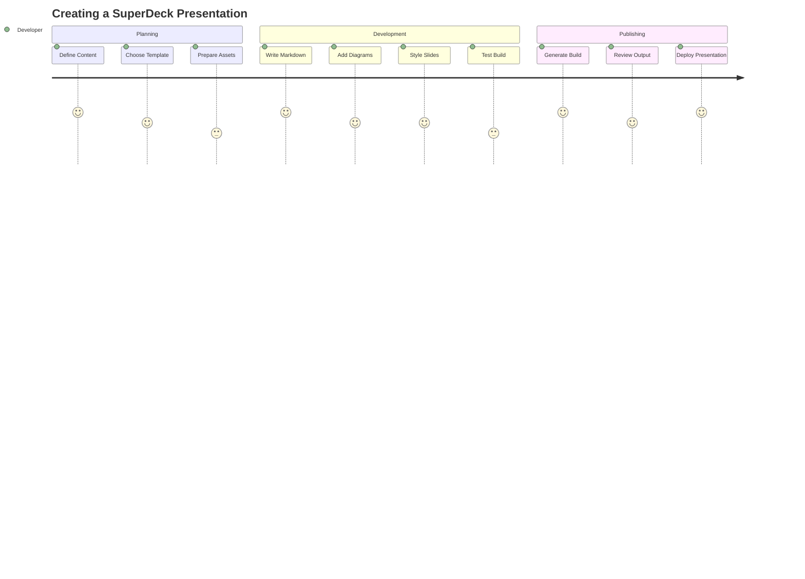
````

## Gantt charts

Project timeline visualization:

````markdown
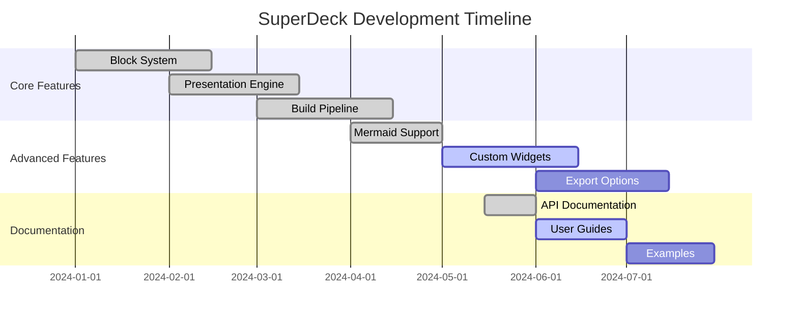
````

## Entity-relationship diagrams

Database schema visualization:

````markdown
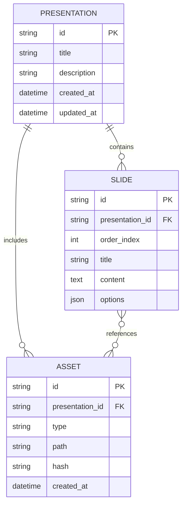
````

## Styling and theming

`MermaidGenerator` uses Mermaid’s `base` theme with a dark set of `themeVariables` by default.

Some diagram types (for example, `timeline` in dark mode) fall back to Mermaid’s `default` theme to keep axes and grid lines readable.

### Per-diagram styling

To customize a single diagram, use Mermaid’s `init` directive at the top of the code block:

````markdown
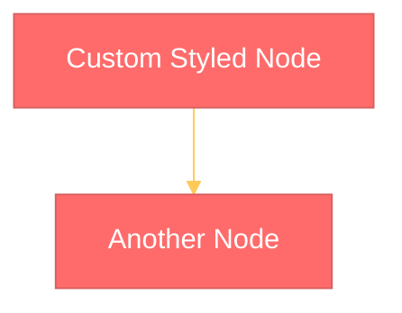
````

## Advanced features

### Subgraphs

Group related nodes together:

````markdown
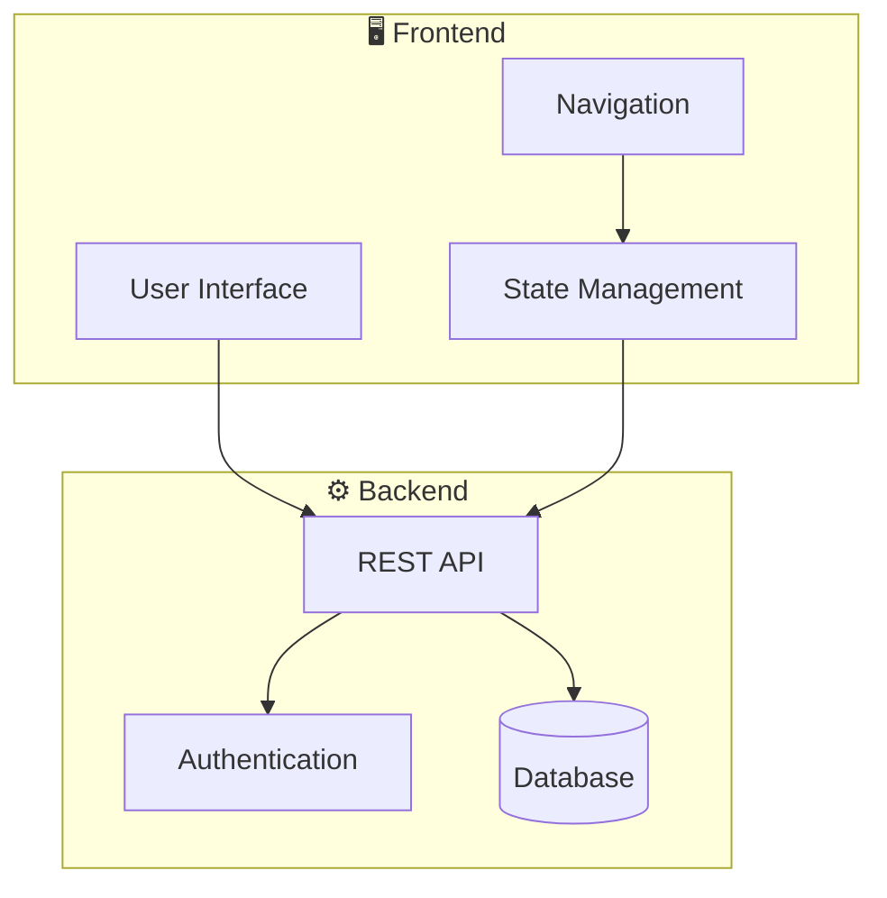
````

### Links

Mermaid supports `click` directives in SVG output. The generator renders diagrams to PNG, so click interactions are not preserved. If you need links, add them as normal Markdown next to the diagram.

### Comments

Add documentation to your diagrams:

````markdown
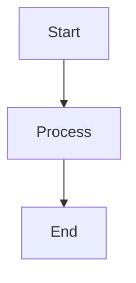
````

## Build process

> Automatic rendering through the CLI is not currently wired up. The
> `superdeck_mermaid` package exposes a standalone `MermaidGenerator` that
> converts Mermaid syntax into PNG bytes via a headless browser; CLI/build
> integration will return in a future release.

## Troubleshooting

### Common issues

1. **Syntax Errors**: Validate your Mermaid syntax using the [official live editor](https://mermaid.live/)
2. **Rendering Failures**: `MermaidGenerator.render()` throws on invalid syntax; inspect the exception message for the underlying Mermaid error
3. **Complex Diagrams**: Very large diagrams may timeout — try breaking them into smaller parts or raise the generator timeout via `configuration`

## Best practices

### Design guidelines

1. **Keep it Simple**: Avoid overly complex diagrams
2. **Use Colors Wisely**: Consider presentation background when styling
3. **Readable Text**: Ensure text is large enough for presentation viewing
4. **Consistent Style**: Use similar styling across all diagrams

### Accessibility

- Default theme provides good contrast for presentations
- Text sizes are optimized for presentation viewing
